# Q-Rex — FSOC Coarse-Alignment Virtual Camera Tracker

A software-only **pointing / acquisition / tracking (PAT) coarse-alignment system** for mobile Free-Space Optical
Communication terminals — ISRO / Department of Space problem statement **26169**.

A virtual pan-tilt camera looks at a 2000×2000 px scene. The system **finds** a moving optical beacon, **locks** onto
it, **estimates** its motion and **steers** the camera to keep it centred — while the scene is degraded by image noise,
camera jitter, platform motion, atmospheric haze/fog/rain, low light and turbulence. A live GUI shows tracking
statistics; a performance log is generated automatically; and a recorded `.mp4` can be fed in instead of the simulated
camera (Benchmark 2).

Everything runs **offline**: in a browser, headless under Node.js (tests/benchmarks) and as a native desktop app
(Electron). There is no server and no network access.

---

## Contents

1. [At a glance](#1-at-a-glance)
2. [Quick start](#2-quick-start)
3. [System architecture](#3-system-architecture)
4. [Repository layout](#4-repository-layout)
5. [How one frame is processed](#5-how-one-frame-is-processed)
6. [Module reference](#6-module-reference)
7. [Algorithms in detail](#7-algorithms-in-detail)
8. [Tracker state machine](#8-tracker-state-machine)
9. [Configuration reference](#9-configuration-reference)
10. [Metrics and the performance log](#10-metrics-and-the-performance-log)
11. [The GUI](#11-the-gui)
12. [Benchmark 2 — video input](#12-benchmark-2--video-input)
13. [Testing](#13-testing)
14. [Results](#14-results)
15. [Build, packaging and the `release/` folder](#15-build-packaging-and-the-release-folder)
16. [Recreating this project from scratch](#16-recreating-this-project-from-scratch)
17. [Specification compliance and honest limitations](#17-specification-compliance-and-honest-limitations)
18. [Troubleshooting](#18-troubleshooting)
19. [Future work](#19-future-work)

---

## 1. At a glance

| Item | Value |
|---|---|
| Language / runtime | JavaScript (ES modules), Node ≥ 20, any modern browser, Electron 44 |
| GUI | React 19 + Vite 8, drawn on HTML canvas |
| Detector | impulse-robust multi-scale matched filter with self-calibrated CFAR, sub-pixel centroid |
| Estimator | 2-model IMM Kalman filter (constant velocity + constant acceleration), adaptive noise |
| Controller | feed-forward + feedback velocity command, minimum-time stopping profile |
| Camera | 640×480, FOV 4°×3° (160 px/°), ≥ 30 Hz, mono (optional colour) |
| Scene | ≥ 2000×2000 px, 7 motions, decoys, dropouts |
| Disturbances | salt & pepper ≤ 10 %, Gaussian σ ≤ 20, Poisson, jitter ≤ ±20 px/frame, platform ≤ 20 px/frame (5 models), haze / fog / rain / low light, turbulence |
| Tests | 38 automated tests + 1 browser end-to-end test |
| Source size | ≈ 2300 lines (engine + GUI), no runtime dependency except React |

Spec targets and measured results (3 seeds × 20 s, one disturbance at a time):

| Requirement | Spec | Measured |
|---|---|---|
| Acquisition time | ≤ 2 s | 0.6–0.9 s (1.93 s worst case, 20 px/frame platform) |
| Tracking error | ≤ 10 px | 0.1–1 px; 6.8 px with ±20 px/frame jitter |
| Target loss | < 5 % | 0–0.1 % |
| Re-acquisition | ≤ 1 s | ≤ 0.53 s |
| Processing speed | ≥ 20 FPS | 2–8 ms/frame (≈ 120–500 FPS) |

**Known limit:** jitter ±20 px/frame **and** platform motion 20 px/frame together give ≈ 19 px mean error
(see [§17](#17-specification-compliance-and-honest-limitations)).

---

## 2. Quick start

Requirements: **Node.js ≥ 20** and npm. (ffmpeg + Chromium + a global `puppeteer` only for `npm run e2e`.)

```bash
cd tracking-app
npm install

npm run dev            # live GUI            → http://localhost:5173
npm test               # 38 tests (engine + one per spec-table row)
npm run bench -- 3 20  # headless scenario suite: 3 seeds × 20 s  (≈15 min)
npm run e2e            # Benchmark-2 end-to-end test in headless Chromium
npm run lint           # oxlint

npm run build          # normal Vite build        → dist/
npm run build:single   # ONE offline HTML file    → dist-single/q-rex.html
npm run build:exe      # native desktop app       → release/q-rex-<platform>-<arch>/
node scripts/docs-pdf.mjs   # docs/*.md → docs/*.pdf
```

Just want to run it? Open `dist-single/q-rex.html` in Chrome/Edge/Firefox (double-click, no server), or run the
executable in `release/` ([§15](#15-build-packaging-and-the-release-folder)).

---

## 3. System architecture

### 3.1 Big picture

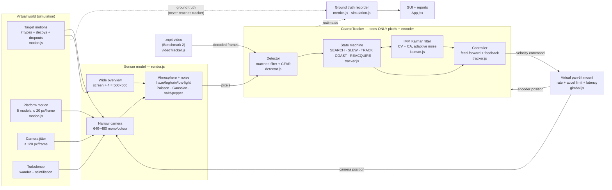

Design rules that the code enforces:

1. **The tracker never sees ground truth.** Its only inputs are the frame(s), the gimbal encoder position and the clock
   (a unit test asserts the exact key set `cam,dt,fps,getOverview,k,narrow,t`).
2. **Simulation time is frame-locked** (`dt = 1/fps`); timing metrics (acquisition, re-acquisition) use simulation time,
   performance metrics (FPS, ms/frame) use wall-clock time around the tracker only.
3. **Deterministic:** every subsystem has its own seeded random stream; the same seed gives a bit-identical log.
4. **The engine has no DOM dependency**, so the same code runs in the browser, in Node (tests, benchmarks) and in Electron.

### 3.2 Module dependency graph

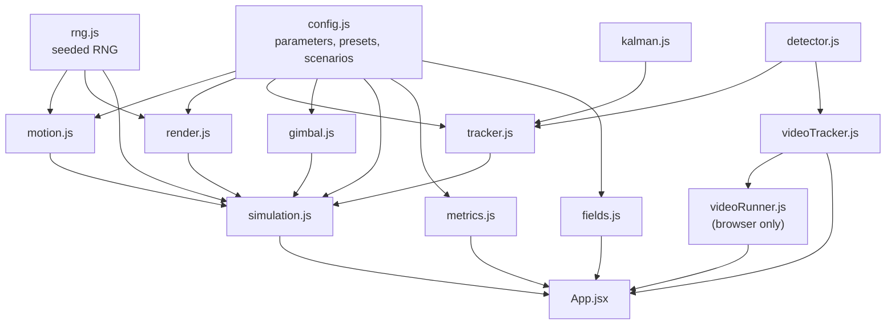

### 3.3 Runtime targets

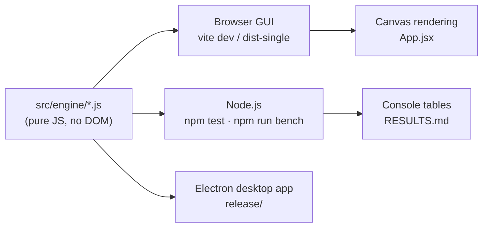

---

## 4. Repository layout

```
tracking-app/
├── src/
│   ├── engine/                 ← the whole tracking system (no DOM, runs anywhere)
│   │   ├── config.js           all parameters + defaults + ranges, atmosphere presets, 15 scenarios, camScale()
│   │   ├── rng.js              seeded random streams (mulberry32 + splitmix), Gaussian, Poisson
│   │   ├── motion.js           target motions (7), platform motions (5), arc-length parameterisation
│   │   ├── render.js           sensor model: beacon rendering, atmosphere, noise, overview frame, colour option
│   │   ├── detector.js         impulse rejection → matched filter → CFAR → validation → sub-pixel centroid
│   │   ├── kalman.js           IMM (CV + CA) Kalman filter with adaptive noise
│   │   ├── tracker.js          state machine, acquisition, gating, controller
│   │   ├── gimbal.js           pan/tilt mount dynamics
│   │   ├── simulation.js       closed loop + ground-truth recording
│   │   ├── metrics.js          metric definitions, JSON / CSV / HTML report writers
│   │   ├── videoTracker.js     Benchmark-2 tracker for decoded video frames (+ GT parsing, video metrics)
│   │   └── videoRunner.js      browser-only: frame-exact .mp4 decoding loop
│   ├── App.jsx                 GUI (canvas views, tiles, benchmark panels)
│   ├── fields.js               declarative description of the parameter panel
│   ├── main.jsx, index.css     React entry + styles
│   └── assets/                 (unused leftovers from the Vite template — safe to delete)
├── tests/
│   ├── engine.test.mjs         12 engine tests
│   └── spec.test.mjs           26 tests, one+ per row of the specification table
├── scripts/
│   ├── bench.mjs               headless scenario suite
│   ├── e2e-video.cjs           browser end-to-end Benchmark-2 test (ffmpeg + puppeteer)
│   ├── inline-dist.mjs         dist/ → ONE offline HTML file
│   ├── build-exe.mjs           Electron packager driver → release/
│   └── docs-pdf.mjs            docs/*.md → PDF (marked + headless Chromium)
├── desktop/
│   ├── main.cjs                Electron main process (opens q-rex.html in a window)
│   ├── package.json            minimal manifest for the desktop shell
│   └── q-rex.html              (generated copy of dist-single/q-rex.html — git-ignored)
├── docs/                       technical report, user manual, traceability matrix, demo script (.md + .pdf)
├── dist/                       Vite build output (git-ignored)
├── dist-single/q-rex.html      the single-file offline build (≈ 280 kB)
├── release/                    packaged desktop apps (≈ 650 MB, git-ignored) — see §15
├── RESULTS.md                  benchmark table of the final code
├── index.html, vite.config.js  Vite entry (base './' so builds work from any folder)
├── package.json                scripts + dependencies
└── .gitignore
```

---

## 5. How one frame is processed

`Simulation.step()` advances the world by exactly one frame (`dt = 1/30 s`):

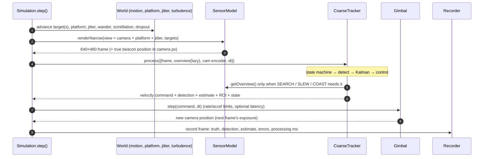

Important details:

* The command computed from frame *k* acts during the interval *k → k+1*, so there is a natural one-frame latency;
  the controller aims at the **latency-compensated prediction** (`predictAhead(dt)`).
* **Jitter and platform motion shift the line of sight** (`view = camera + platform + jitter`). The tracker only sees
  the shifted image; it knows its encoder position but **not** the platform offset.
* The **overview frame** is rendered lazily (only if the tracker asks for it) and rides on the same platform as the
  narrow camera, so both measure target − platform in the same coordinates.

---

## 6. Module reference

### `config.js`
Single source of truth. Exports `DEFAULTS`, `clampConfig()` (clamps every value to the specification range),
`camScale(cfg)` = screen px per camera px = `fovX·160/camW` (1.0 at 640 px / 4°), `PPD = 160` (screen px per degree),
`MOTIONS`, `ATMOSPHERES`, `PLATFORM_MODELS` and `SCENARIOS` (15 named scenarios used by the GUI suite and the benchmark).

### `rng.js`
`RNG(seed, stream)`: independent streams per subsystem (`mulberry32` seeded through `splitmix32`).
`next()`, `uniform()`, `gauss()` (Box–Muller with cached spare), `poisson(λ)` (Knuth for λ ≤ 12, normal approximation above).

### `motion.js`
* **Target motions** (`makeTargetMotion`): `linear`, `circular`, `figure8`, `random`, `spiral`, `sinusoidal`, `waypoints`.
  * Curves are **re-parameterised by arc length** (`ArcPath`): the configured speed in px/s is exact.
  * `linear` / `random` turn away from walls on constant-radius arcs with a ramped turn rate (no velocity jumps).
  * `random` = heading rate follows an Ornstein–Uhlenbeck process (smooth, bounded acceleration).
  * `waypoints` = closed Catmull-Rom spline through the user's points (rounded corners → physically trackable).
  * "Initial location": random, or user-defined (start point for linear/random, **path centre** for parametric paths).
* **Platform motion** (`makePlatformMotion`): `linear` (default), `circular`, `random`, `spiral`, `figure8`; per-frame
  displacement never exceeds `platformSpeed` px/frame (≤ 20); bounded to ±400 px; speed/on-off are read live.

### `render.js` — the sensor model
* **Beacon**: exact pixel integral of a Gaussian-blurred box (antiderivative of the normal CDF), so sub-pixel motion is
  faithful. Circle/diamond use a 4× supersampled mask, Gaussian blurred.
* **PSF** σ = √(0.5² + atmosphere blur² + (1.2·turbulence)²).
* **Atmosphere**: `I' = C·I + B` (contrast/brightness) + blur + rain streaks, interpolated from clear by *severity*.
* **Noise order**: Poisson → Gaussian → salt & pepper → clip to 0…255.
* **Overview frame**: scene ÷ 4 (500×500); noise drawn from the *binned-pixel statistics* (variance ÷ 16) for speed.
* **Colour camera** (optional): three independently-noisy channels (reddish beacon, bluish-grey background); the tracker
  receives the luminance `0.299R + 0.587G + 0.114B`.

### `detector.js` — see [§7.1](#71-detection)
### `kalman.js` — see [§7.2](#72-estimation-imm-kalman-filter)
### `tracker.js` — see [§8](#8-tracker-state-machine) and [§7.3](#73-control)

### `gimbal.js`
Velocity-commanded mount. Per axis: command clipped to the rate limit (`maxPanSpeed`/`maxTiltSpeed` × 160 px/°),
velocity change clipped to `maxAccel × dt`, optional command latency queue (`extraLatency` frames). Pointing range is
the screen **plus 450 px** on every side so platform offsets can still be compensated at the screen edge.

### `simulation.js`
Owns the world, sensor, tracker and gimbal; `step()`, `run(seconds)`, `reset(cfg)`, `updateLive(partial)` (change
disturbances/tuning without restarting). Records one object per frame with ground truth, detection, estimate, errors,
processing time, state, saturation flag, jitter and platform offsets.

### `metrics.js`
`computeMetrics(records, cfg, wallSeconds)` → all metrics + K01–K05 pass/fail; `recordsToCSV`, `metricsToHTML`.

### `videoTracker.js` / `videoRunner.js` — see [§12](#12-benchmark-2--video-input)

### `App.jsx` / `fields.js` — see [§11](#11-the-gui)

---

## 7. Algorithms in detail

### 7.1 Detection

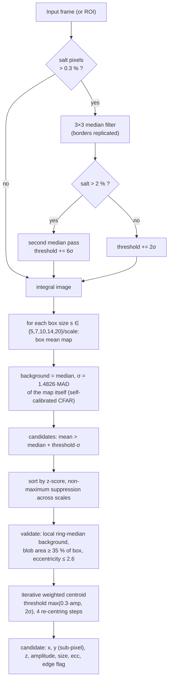

Why each step exists:

* **Median filter** removes impulse noise; it is applied only when salt pixels (≥ 254.5) exceed 0.3 % of a sparse sample,
  because a median would otherwise blur small targets for no reason. Borders are filtered too (an edge salt pixel once
  caused false alarms).
* **Box filter = matched filter** for a flat-topped blob in white noise; five scales cover 5–20 px. The integral image
  makes each scale O(pixels).
* **Self-calibrated CFAR:** per scale, background and noise level are the median and MAD of the box-filter output
  itself. This automatically absorbs correlated noise, clipping at 0, and the noise-type mix — the detector needs no
  knowledge of the noise model. Threshold default 6σ.
* **Validation:** the thresholded blob must fill ≥ 35 % of its matched box (surviving impulse pixels fail this) and
  must not be streak-like (rain).
* **Centroid:** local background from a ring median (works on non-flat video backgrounds); weights `max(0, v − bg − τ)`
  with `τ = min(0.6·A, max(0.3·A, 2σ))`; re-centred 4 times. Measured RMSE 0.02–0.2 px.
* **ROI mode:** in tracking only a window around the prediction (half-width 64–160 px) is processed.

### 7.2 Estimation (IMM Kalman filter)

State per axis `[position, velocity, acceleration]`; x and y are decoupled but share model probabilities.

| Model | Dynamics | Process noise (PSD) |
|---|---|---|
| CV — constant velocity | acceleration forced to 0 | white acceleration, `q = 2·10⁴ px²/s³` |
| CA — constant acceleration | acceleration persists | white jerk, `q = 5·10⁷ px²/s⁵` |

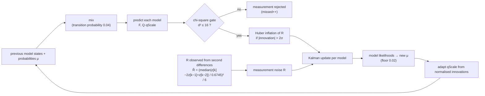

* **Measurements are world positions:** `encoder position + (centroid − image centre)·camScale`. The filter therefore
  tracks *target minus platform* directly.
* **Measurement noise is observable:** for a smooth trajectory `var(z[k] − 2z[k−1] + z[k−2]) = 6R`, so jitter level is
  learned online (median absolute deviation, robust to outliers) without a motion model. The detector's own SNR-based
  σ acts as the floor.
* **Process-noise adaptation:** `qScale ∈ [0.02, 1]`. Two consecutive normalised innovations above the 1 % level
  (NIS > 4.5) → ×1.8 immediately (manoeuvre); mean NIS > 1.4 → ×1.2; mean NIS < 0.8 → ×0.97 per frame. This makes the
  filter loose on manoeuvres and tight on steady motion.
* `predictAhead(τ)` extrapolates the combined state; the acceleration term is weighted by the CA-model probability.

### 7.3 Control

Per axis, with `p` = encoder position and `x̂_aim = predictAhead(dt·(1 + extraLatency))`:

```
d   = x̂_aim − p
u   = g · d/dt + (1 − g) · v̂              g = controlGain (0.85)
rel = u − v̂
limit |rel| ≤ √(2 · 0.85·a_max · |d|)      (minimum-time stopping profile, avoids overshoot)
```

The gimbal then enforces the rate limit and acceleration limit. In COAST the velocity feed-forward decays linearly to
zero so the camera does not run away along a stale trajectory.

### 7.4 Acquisition: why a wide view?

The 640×480 camera covers only **7.7 %** of the 2000×2000 screen. A boustrophedon scan needs ≥ 5 swaths ×
2000 px ÷ 800 px/s ≈ **12.5 s**, so "acquisition ≤ 2 s" is physically impossible by scanning with the narrow camera.
Q-Rex therefore uses a **wide overview frame (screen binned 4×)** *only while searching or re-acquiring* — exactly like
the Benchmark-2 videos, which cover the whole screen. Tracking itself uses only the narrow camera. A raster-scan mode
without the overview is implemented too (`acquisition = scan`) and reported honestly (it cannot meet 2 s).

---

## 8. Tracker state machine

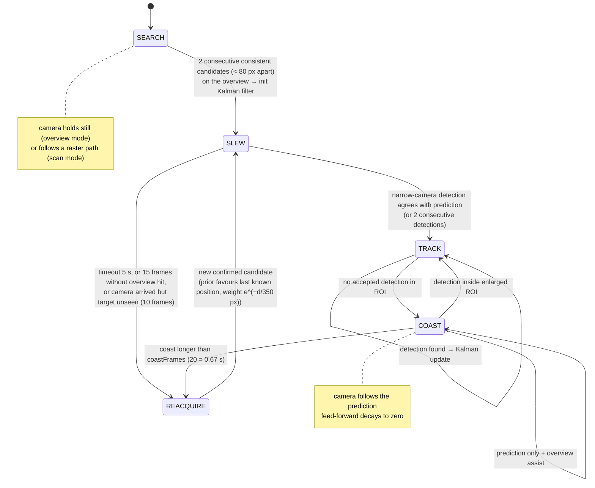

* **Identification / decoys:** the designated beacon is the strongest candidate at first lock; afterwards candidates
  are accepted only if they are nearest to the predicted position within a gate, so decoys cannot steal the lock.
* **Hysteresis:** 2 consecutive consistent candidates are required to leave SEARCH; the slew timeout and the
  "arrived-but-unseen" exit prevent deadlock.
* **Search window sizes:** SLEW ROI radius 70–200 px; TRACK 64–160 px (grows with filter uncertainty and speed);
  COAST up to the whole frame.

---

## 9. Configuration reference

All values are clamped by `clampConfig()`. Defaults in **bold**. "Spec" = row number of the specification table.

### Camera
| Key | Default | Range | Spec | Meaning |
|---|---|---|---|---|
| `screenSize` | **2000** | 2000–6000 | 1 | square screen, px |
| `cameraType` | **mono** | mono, colour | 2 | tracker uses luminance |
| `camW`, `camH` | **640**, **480** | 160–1280, 120–960 | 3 | camera resolution |
| `fovX` | **4**° | 1–12° | 4 | horizontal FOV (vertical = fovX·camH/camW → 3°) |
| `fps` | **30** | 30–120 | 5, 15 | camera and control rate |
| `maxPanSpeed`, `maxTiltSpeed` | **5**, **5** °/s | 5–10 | 13, 14 | rate limits |
| `maxAccel` | **20** °/s² | 5–100 | — | gimbal acceleration (not in spec) |
| `extraLatency` | **0** frames | 0–4 | — | additional command latency |

### Target
| Key | Default | Range | Spec |
|---|---|---|---|
| `numTargets` | **1** | 1–6 (extra = decoys) | 8 |
| `targetShape` | **square** | square, circle, diamond | 9 |
| `targetSize` | **10** px | 5–20 | 10 |
| `targetIntensity` | **230** | grey level | — |
| `startMode`, `startX`, `startY` | **random** | random / user | 11 |
| `motion` | **circular** | linear, circular, figure8, random, spiral, sinusoidal, waypoints | 12 |
| `targetSpeed` | **200** px/s | 20–700 | — |
| `waypoints` | 4 sample points | `x,y` per line | 12 |

### Disturbances
| Key | Default | Range | Spec |
|---|---|---|---|
| `saltPepper`, `saltPepperDensity` | off, **0.10** | 0–0.10 | 21.1 |
| `gaussian`, `gaussianSigma` | off, **10** | σ 0–20 grey levels | 21.1, 21.2 |
| `poisson` | off | on/off | 21.1 |
| `jitter`, `jitterMax` | off, **10** px/frame | 0–20 | 21.3 |
| `atmosphere`, `atmosphereLevel` | **clear**, 1.0 | clear, haze, fog, rain, lowlight; 0–1 | 21.4 |
| `platform`, `platformModel`, `platformSpeed` | off, **linear**, **10** px/frame | linear, circular, random, spiral, figure8; 0–20 | 21.5 |
| `turbulence` | **0** | 0–1 | — |
| `dropout`, `dropoutEvery`, `dropoutLen` | off, 6 s, 0.5 s | — | re-acquisition test aid |
| `background` | **20** | grey level | — |

Atmosphere presets (`I' = C·I + B`, plus blur): haze C 0.70 B +18 blur 1.0 · fog 0.45 / +35 / 2.0 · rain 0.75 / +5 / 0.8
+ streaks · low light 0.35 / −5 / shot-noise ×3.

### Tracker
| Key | Default | Range |
|---|---|---|
| `acquisition` | **overview** | overview, scan |
| `controlGain` | **0.85** | 0.2–1 |
| `detectThreshold` | **6** σ | 4–10 |
| `coastFrames` | **20** | 3–90 |
| `seed` | **1** | any |
| `duration` | **30** s | 0 = endless |

*Noise σ:* the statement says "20 pixels"; it is interpreted as **20 grey levels** on a 0–255 scale.

### Built-in scenarios (`SCENARIOS`)
A1 nominal · A2 straight line · A3 figure-8 · A4 random · B1 Gaussian σ=20 · B2 salt & pepper 10 % · B3 Poisson ·
B4 jitter ±20 · B5 platform 20 px/frame · B6 fog · B7 rain · B8 low light · B10 beacon dropouts · B9 decoys ·
C1 every disturbance at its maximum.

---

## 10. Metrics and the performance log

Exact definitions (also in `docs/TECHNICAL_REPORT.md`):

| Metric | Definition |
|---|---|
| **Tracking (boresight) error** | distance of the *true* beacon from the image centre, **excluding** the random per-frame jitter that the camera itself suffers (also reported including jitter). Steady-state window: from the first frame within 10 px after lock; only frames where the beacon is inside the FOV |
| **Centroiding error** | detector centroid vs true beacon position in the same frame — mean, RMSE, P95, max |
| **Acquisition time** | simulation time from start to the first confirmed TRACK inside the narrow FOV (`timeToCentreSec` = first frame ≤ 10 px) |
| **Target loss %** | frames since first lock where the beacon is outside the FOV ÷ all frames since first lock |
| **Lock retention %** | frames in TRACK/COAST with beacon in FOV and estimate within 60 px ÷ frames since first lock |
| **Re-acquisition time** | time from leaving TRACK to the next TRACK; maximum over all events |
| **FPS / processing time** | wall-clock of tracker + controller per frame (scene rendering excluded); `endToEndFPS` also logged |
| **Gimbal saturation %** | frames where the command exceeded the rate limit |

**Spec checks** reported in every run: K01 acquisition ≤ 2 s · K02 mean tracking error ≤ 10 px ·
K03 target loss < 5 % · K04 re-acquisition ≤ 1 s · K05 ≥ 20 FPS.

**Automatic performance log:** at the end of a timed run the GUI downloads `performance_report.json`,
`performance_report.html` and `tracking_log.csv` (one row per frame: truth, detection, estimate, all errors, state,
processing time, jitter and platform offsets). Buttons export the same files at any time. The JSON also contains the
complete configuration, so a run can be reproduced from its seed.

Report fields: `simulationDurationSec`, `framesProcessed`, `averageFPS`, `endToEndFPS`, `processingTimeMeanMs/P95Ms/MaxMs`,
`acquisitionTimeSec`, `timeToCentreSec`, `trackingErrorMeanPx/RmsePx/P95Px/P99Px/MaxPx`, `trackingErrorInclJitterMeanPx`,
`centroidingErrorMeanPx/RmsePx/P95Px/MaxPx`, `lockRetentionRatePct`, `targetLossPct`, `reacquisitionEvents`,
`reacquisitionDeclaredLosses`, `reacquisitionTimeMeanSec/MaxSec`, `gimbalSaturationPct`, `checks`, `passAll`, `config`.

---

## 11. The GUI

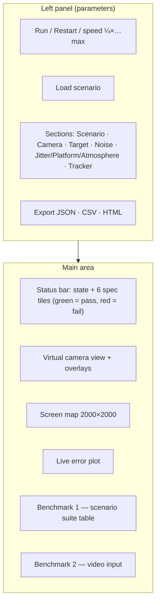

* **Live vs restart:** disturbance and tracker controls apply **live** (`Simulation.updateLive`); scene/camera/target
  controls restart the run.
* **Camera overlays:** red cross = boresight · green square = detection · yellow circle = filter estimate · cyan dashed
  box = search ROI · magenta circle = ground truth (toggle).
* **Screen map:** blue box = camera footprint, magenta trail + dot = true beacon, green circle = estimate.
* **Live error:** last 300 frames, dashed red line = 10 px spec, strip below = tracker state colours.
* **Main loop:** `requestAnimationFrame` with an accumulator at `fps × speed`; "max" runs as many frames as fit in a
  time budget.
* **Warning banner** when target speed + platform speed exceeds the gimbal limit.

---

## 12. Benchmark 2 — video input

The evaluator supplies `.mp4` files @ 30 fps covering the complete screen; the software must **bypass the PTZ camera**
and use the video as input.

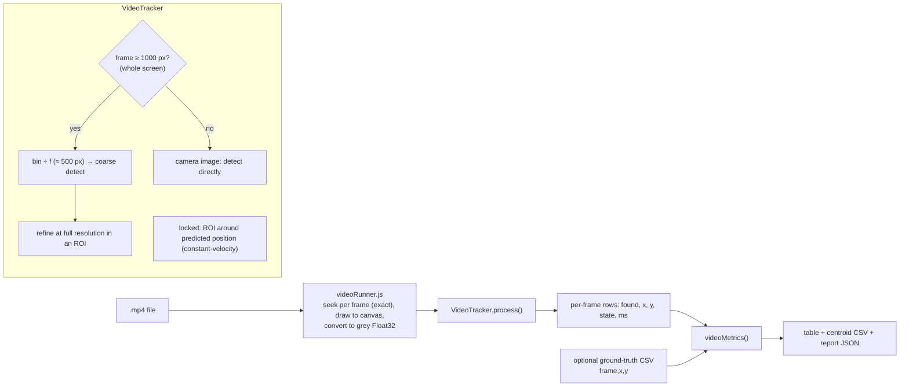

* Same `Detector` as the live system. Confirmation needs 2 consistent detections (< 60 px apart); lock is dropped after
  15 missed frames; candidates in search are weighted by `e^(−d/350)` toward the last position.
* Output coordinates use the **OpenCV pixel-index convention** (centre of the first pixel = 0.0); ground truth must use
  the same convention. Centroid CSV columns: `frame,t,found,x,y,state,procMs`.
* Metrics: frames, frame size, duration, FPS, acquisition time, lock retention, re-acquisition events/time, and — with
  ground truth — centroiding error mean / RMSE / P95 / max.
* Verified end-to-end (`npm run e2e`): 2000×2000 H.264 video, noise σ≈12, exact ground truth → acquisition 0.033 s,
  lock 100 %, centroid RMSE 0.072 px.
* Any resolution, aspect, fps, colour format is accepted (colour is converted to grey).

---

## 13. Testing

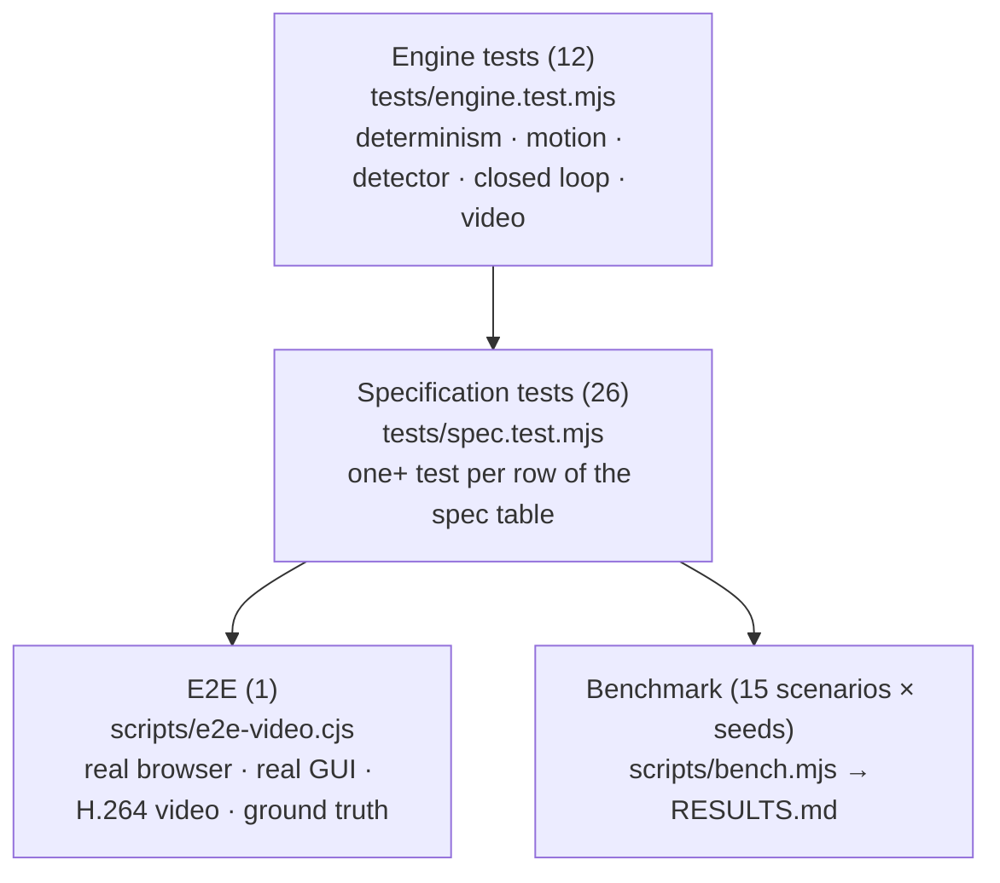

`npm test` runs 38 tests in ≈ 90 s.

| File | What it proves |
|---|---|
| `engine.test.mjs` | RNG determinism; config clamping; all 7 motions stay on screen at the configured speed (±6 %); platform step ≤ 20 px/frame for all 5 models; sub-pixel centroid under Gaussian σ 20, salt & pepper, fog (sizes 5/10/20); false-alarm rate on empty noisy frames; nominal closed loop passes; same seed ⇒ identical logs; scan acquisition; decoy rejection; video tracker on synthetic 2000×2000 stream; defaults equal the spec |
| `spec.test.mjs` | rows 1–21 of the specification table: screen size, mono + colour camera, resolution, FOV (2°/8°), update rate, initial camera position, target count, shapes, sizes, initial location, all motions, 5 & 10 °/s limits really enforced, control rate, acquisition / error / loss / re-acquisition / FPS on the four mandatory motions, re-acquisition after the camera is knocked 450 px off and after 0.5 s dropouts, every noise type and combination, σ ≈ 20 really applied, jitter bounded at ±20, atmosphere reduces contrast and is survivable, all 5 platform models, turbulence, decoys, performance-log fields, "ground truth never reaches the tracker" |
| `e2e-video.cjs` | needs `ffmpeg`, Chromium (`/usr/bin/chromium`) and a **global** `puppeteer` (`npm i -g puppeteer`): synthesises the video, uploads it with its ground-truth CSV through the GUI, asserts RMSE < 1 px, lock ≥ 99 %, acquisition ≤ 0.2 s |
| `bench.mjs` | `node scripts/bench.mjs [seeds] [seconds] [scenario-filter]` — table of all metrics + pass counts |

Two example bugs the tests found: the mount saturated at the screen edge when the platform shifted the view (fixed by the
±450 px pointing range), and the filter froze after long straight runs then lost the target at wall turns (fixed by the
fast manoeuvre rule in the process-noise adaptation).

---

## 14. Results

Final code, 3 seeds × 20 s per scenario (`npm run bench -- 3 20`; full table in [`RESULTS.md`](RESULTS.md)):

| Scenario | Acq s | Err px | Cent RMSE px | Loss % | Lock % | Re-acq s | ms/frame | Pass |
|---|---|---|---|---|---|---|---|---|
| A1 circular | 0.62 | 0.4 | 0.05 | 0 | 100 | 0 | 3.2 | 3/3 |
| A2 straight line | 0.68 | 0.1 | 0.03 | 0 | 100 | 0 | 6.3 | 3/3 |
| A3 figure-8 | 0.66 | 0.4 | 0.06 | 0 | 100 | 0 | 3.0 | 3/3 |
| A4 random | 0.59 | 0.4 | 0.06 | 0 | 100 | 0.03 | 2.9 | 3/3 |
| B1 Gaussian σ=20 | 0.61 | 1.0 | 0.11 | 0.1 | 99.9 | 0 | 8.0 | 3/3 |
| B2 salt & pepper 10 % | 0.62 | 0.4 | 0.11 | 0 | 100 | 0 | 5.3 | 3/3 |
| B3 Poisson | 0.61 | 0.8 | 0.09 | 0.1 | 99.9 | 0 | 6.2 | 3/3 |
| B4 jitter ±20 | 0.62 | 6.8 | 0.05 | 0 | 100 | 0 | 2.6 | 3/3 |
| B5 platform 20 px/frame | 1.26 (max 1.93) | 0.8 | 0.05 | 0 | 98.3 | 0.53 | 2.0 | 3/3 |
| B6 fog | 0.61 | 0.4 | 0.06 | 0.1 | 99.9 | 0 | 3.1 | 3/3 |
| B7 rain | 0.62 | 0.4 | 0.02 | 0 | 100 | 0 | 3.1 | 3/3 |
| B8 low light | 0.62 | 0.5 | 0.05 | 0 | 100 | 0 | 2.9 | 3/3 |
| B9 decoys | 0.62 | 0.4 | 0.06 | 0 | 100 | 0 | 2.9 | 3/3 |
| B10 dropouts 0.5 s | 0.62 | 0.9 | 0.05 | 0 | 100 | 0.50 | 3.7 | 3/3 |
| **C1 all disturbances at max** | 1.24 | **19.2** | 1.14 | 0 | 98.5 | 0.03 | 16.1 | **0/3** |

---

## 15. Build, packaging and the `release/` folder

### What `release/` is

`release/` is the **output of `npm run build:exe`**: a ready-to-run **native desktop application**, produced by
[`@electron/packager`](https://github.com/electron/packager). It is the "standalone executable" the problem statement asks
for. Each sub-folder is one platform:

```
release/
├── q-rex-linux-x64/        ← run  ./q-rex
│   ├── q-rex               the executable (Electron runtime + our app)
│   ├── resources/app.asar  our code: main.cjs + the single-file q-rex.html
│   └── *.so, *.pak, …      Chromium / Electron runtime files
└── q-rex-win32-x64/        ← run  q-rex.exe   (copy the whole folder to a Windows PC)
    └── q-rex.exe …
```

* It is **large (~280–350 MB per platform)** because every copy bundles a full Chromium + Node runtime — that is how Electron
  makes an app run with **no installation and no internet**.
* It is **a build artifact**, not source: it is git-ignored and can be rebuilt at any time. **Do not commit it.**
  To share it, zip each platform folder and attach it to a GitHub *Release* (or any file share).
* To run: copy the whole `q-rex-<platform>/` folder to the target machine and start `q-rex` / `q-rex.exe`. The
  application is the same GUI as the browser version.
* Only the Linux build has been launched during development; the Windows build was packaged but not run.

### Build pipeline

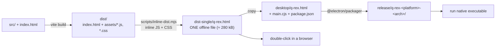

Commands:

```bash
npm run build:single                 # dist-single/q-rex.html
npm run build:exe                    # release/ for the current OS / arch
node scripts/build-exe.mjs win32 x64 # cross-package for Windows (also darwin, linux; arch x64 / arm64)
```

`desktop/main.cjs` is the whole Electron shell: it creates one 1500×950 window, hides the menu, disables background
throttling (so the simulation keeps real-time pacing) and loads `q-rex.html`.

### Which output do I use?

| Output | Size | Needs | Use for |
|---|---|---|---|
| `npm run dev` | — | Node + npm | development |
| `dist-single/q-rex.html` | 280 kB | a browser | quick demo, e-mailing, evaluators |
| `release/q-rex-*/` | ~300 MB each | nothing | "standalone executable" deliverable |

---

## 16. Recreating this project from scratch

1. **Scaffold**
   ```bash
   npm create vite@latest tracking-app -- --template react
   cd tracking-app
   npm i
   npm i -D electron @electron/packager marked oxlint
   ```
   Set `"type": "module"` and the scripts from [§2](#2-quick-start) in `package.json`; in `vite.config.js` use
   `base: './'` with `@vitejs/plugin-react`.
2. **Create `src/engine/`** and write the modules in this order (each is testable on its own; the spec for each is in
   [§6](#6-module-reference) and [§7](#7-algorithms-in-detail)):
   1. `rng.js` → 2. `config.js` → 3. `motion.js` → 4. `render.js` → 5. `detector.js` (test: centroid error vs. noise) →
   6. `kalman.js` → 7. `gimbal.js` → 8. `tracker.js` → 9. `simulation.js` → 10. `metrics.js` →
   11. `videoTracker.js` → 12. `videoRunner.js`.
3. **GUI:** `fields.js` (declarative parameter list), `App.jsx` (canvas drawing, status tiles, benchmark panels),
   `index.css`.
4. **Scripts:** `bench.mjs`, `inline-dist.mjs`, `build-exe.mjs`, `e2e-video.cjs`, `docs-pdf.mjs`; `desktop/main.cjs` and
   `desktop/package.json` (`{"name":"q-rex","main":"main.cjs"}`).
5. **Tests:** `engine.test.mjs`, `spec.test.mjs` with `node --test`.
6. **Verify:** `npm test` → `npm run bench -- 3 20` → `npm run build:single` → `npm run e2e` → `npm run build:exe`.

### Key numbers to reproduce exactly

| Item | Value |
|---|---|
| Pixel scale | 640 px / 4° = **160 px/°**; 2000 px screen = 12.5°; 5°/s = 800 px/s = 26.7 px/frame |
| Beacon | peak 230, background 20, PSF σ₀ = 0.5 px |
| Overview | binning factor 4 → 500×500; box sizes {1,2,3,5} |
| Narrow box sizes | {5, 7, 10, 14, 20} ÷ camScale (≥ 2 px, unique) |
| CFAR threshold | 6σ (+2σ impulse, +6σ dense impulse) |
| Centroid | window radius ⌈s/2 + 4⌉, τ = min(0.6A, max(0.3A, 2σ)), 4 iterations |
| IMM | q_CV 2·10⁴, q_CA 5·10⁷, switch probability 0.04 (initial μ = 0.6/0.4), gate χ² = 16, μ floor 0.02 |
| qScale | start 0.1; range 0.02–1; ×1.8 on 2 consecutive NIS > 4.5; ×1.2 if mean NIS > 1.4; ×0.97 if < 0.8 |
| R estimate | window 60 second-differences, ≥ 12 needed, `R = (median / 0.6745)² / 6` |
| Controller | g = 0.85; braking limit √(2·0.85·a·d) |
| Gimbal | accel default 20°/s² = 3200 px/s²; pointing range −450 … size + 450 |
| Jitter | per axis truncated Gaussian σ = J/2.5, clipped ±J |
| Platform | bounded ±400 px; wall turn radius 220 px; turn-rate ramp ≤ 0.012 rad/frame² |
| Target wall turns | radius 300 px, margin 70 px, ramp ≤ 0.02 rad/frame² |
| Lock confirm | 2 consecutive overview hits < 80 px apart; narrow detection within 30 px + 3σ of prediction |
| Timeouts | slew 5 s, no overview hit 15 frames, arrived-but-unseen 10 frames, coast 20 frames |
| Platform spiral | radius 150 → 390 px (smaller radii exceed the mount's acceleration) |

---

## 17. Specification compliance and honest limitations

Full requirement → code → test matrix: [`docs/TRACEABILITY.md`](docs/TRACEABILITY.md). Documents:
[`docs/TECHNICAL_REPORT.pdf`](docs/TECHNICAL_REPORT.pdf) (10 pages), [`docs/USER_MANUAL.pdf`](docs/USER_MANUAL.pdf),
[`docs/DEMO_SCRIPT.md`](docs/DEMO_SCRIPT.md).

**Not met / only partly met — stated plainly:**

1. **Jitter ±20 px/frame and platform 20 px/frame simultaneously (scenario C1): ≈ 19 px mean error (spec 10 px).**
   Jitter alone leaves ≈ 7 px for any estimator that uses only past frames (end-point error of a quadratic fit over N = 30
   frames ≈ σ·√(9/N) with σ ≈ 8 px); the wider filter bandwidth the platform needs raises this to ≈ 15–19 px. Filter
   settings, a constant-jerk model and the control gain were swept without effect. The beacon is never lost (0 % loss).
2. **"AI-based":** the AI is **adaptive estimation** (IMM, online noise identification, innovation-driven adaptation),
   not a trained neural network. A learned detector is future work.
3. **Acquisition ≤ 2 s needs the wide overview view** (§7.4); the scan-only mode cannot meet it.
4. **Optional 3–5 minute demo video** is not produced (only `docs/DEMO_SCRIPT.md`).
5. **Never tested:** the evaluators' own Benchmark-1 scenarios and Benchmark-2 videos; the Windows executable
   (packaged, not launched). All numbers come from the project's own simulator and self-generated video.
6. **Performance log in endless mode** (`duration = 0`) is saved only via the export buttons.
7. **"Noise std 20 pixels"** is interpreted as 20 grey levels.

---

## 18. Troubleshooting

| Problem | Cause / fix |
|---|---|
| Acquisition > 2 s | you chose *Raster scan*; use *Wide-view overview* |
| Red tracking-error tile with jitter + platform at maximum | the documented limit above |
| Yellow saturation warning | target + platform speed exceeds the gimbal limit; raise pan/tilt speed (up to 10 °/s) |
| Video does not load | the browser must decode the codec (H.264 works in Chrome/Edge/Electron) |
| GUI sluggish | set *Sim speed* to 1× or run headless (`npm run bench`) |
| `npm run e2e` fails to start | install ffmpeg + Chromium and `npm i -g puppeteer`; the script expects `/usr/bin/chromium` |
| `npm run build:exe` is slow / large | it downloads and bundles an Electron runtime (~100 MB per platform) |
| Pushing to GitHub is rejected | do not commit `release/`, `node_modules/`, `dist/` (they are in `.gitignore`) |

---

## 19. Future work

* Trained heat-map detector (small CNN, simulator-generated training data with domain randomisation) fused with the
  classical detector by inverse-variance weighting, classical detector as fallback.
* Coordinated-turn model in the IMM; offline RTS smoother for Benchmark 2 (reported separately, non-causal).
* Track-before-detect for very low SNR; ego-motion estimation from background texture to cancel jitter.
* Model-predictive control with rate/acceleration constraints; saturation-aware priority logic.
* Automated demo-video generation; CI that builds and smoke-tests Windows and macOS executables.
