# Q-Rex — FSOC Coarse-Alignment Virtual Camera Tracker

A software-only **pointing / acquisition / tracking (PAT) coarse-alignment system** for mobile Free-Space Optical
Communication terminals — ISRO / Department of Space problem statement **26169**.

A virtual pan-tilt camera looks at a 2000×2000 px scene. The system **finds** a moving optical beacon, **locks** onto
it, **estimates** its motion and **steers** the camera to keep it centred — while the scene is degraded by image noise,
camera jitter, platform motion, atmospheric haze/fog/rain, low light and turbulence. A live GUI shows tracking
statistics; a performance log is generated automatically; and a recorded `.mp4` can be fed in instead of the simulated
camera (Benchmark 2).

The app opens on a **home page** (overview, architecture diagrams, innovations, tech stack, results, compliance) and launches the
**Workstation** (`#/app`). Everything runs **offline**: in a browser, headless under Node.js (tests/benchmarks) and as a native desktop app
(Electron). There is no server and no network access.

---

## Contents

1. [At a glance](#1-at-a-glance)
2. [Quick start and how to run](#2-quick-start-and-how-to-run)
3. [System architecture](#3-system-architecture)
4. [Repository layout](#4-repository-layout)
5. [How one frame is processed](#5-how-one-frame-is-processed)
6. [Module reference](#6-module-reference)
7. [Algorithms in detail](#7-algorithms-in-detail) (incl. the learned verifier)
8. [Tracker state machine](#8-tracker-state-machine)
9. [Configuration reference](#9-configuration-reference)
10. [Metrics and the performance log](#10-metrics-and-the-performance-log)
11. [The GUI](#11-the-gui)
12. [Benchmark 2 — video input](#12-benchmark-2--video-input)
13. [Testing](#13-testing)
14. [Results](#14-results)
15. [Build, packaging and the `release/` folder](#15-build-packaging-and-the-release-folder)
16. [Recreating this project from scratch](#16-recreating-this-project-from-scratch)
17. [Specification compliance and honest limitations](#17-specification-compliance-and-honest-limitations)
18. [Troubleshooting](#18-troubleshooting)
19. [Roadmap and future work](#19-roadmap-and-future-work)
20. [Mathematics reference](#20-mathematics-reference) (every formula as implemented)

---

## 1. At a glance

| Item | Value |
|---|---|
| Language / runtime | JavaScript (ES modules), Node ≥ 20, any modern browser, Electron 44 |
| GUI | React 19 + Vite 8, drawn on HTML canvas; home page + workstation; bundled Space Grotesk / JetBrains Mono fonts (offline) |
| Detector | impulse-robust multi-scale matched filter with self-calibrated CFAR, sub-pixel centroid; optional 74 k-parameter CNN verifier (trained on simulator data) |
| Estimator | 2-model IMM Kalman filter (constant velocity + constant acceleration), adaptive noise |
| Controller | feed-forward + feedback velocity command, minimum-time stopping profile |
| Camera | 640×480, FOV 4°×3° (160 px/°), ≥ 30 Hz, mono (optional colour) |
| Scene | ≥ 2000×2000 px, 7 motions, decoys, dropouts |
| Disturbances | salt & pepper ≤ 10 %, Gaussian σ ≤ 20, Poisson, jitter ≤ ±20 px/frame, platform ≤ 20 px/frame (5 models), haze / fog / rain / low light, turbulence |
| Tests | 54 automated tests + a browser end-to-end test + a 21-video robustness matrix |
| Source size | ≈ 3500 lines (engine + GUI + training), runtime dependency: React only (PyTorch is needed only to retrain the CNN) |

Spec targets and measured results (3 seeds × 20 s, one disturbance at a time):

| Requirement | Spec | Measured |
|---|---|---|
| Acquisition time | ≤ 2 s | wide-view mode 0.5–0.8 s (1.87 s worst case, 20 px/frame platform); camera-only zoom mode: detection 0.03 s, centred at 4°×3° in ≤ 1.3 s |
| Tracking error | ≤ 10 px | 0.1–1.2 px; 6.3 px with ±20 px/frame jitter |
| Target loss | < 5 % | 0–0.1 % |
| Re-acquisition | ≤ 1 s | ≤ 0.5 s |
| Processing speed | ≥ 20 FPS | 2–8 ms/frame (≈ 120–500 FPS) |

**Known limit:** jitter ±20 px/frame, platform 20 px/frame and every noise at once give 10.8 px mean error (limit 10 px); an ideal
causal filter that must hit the beacon one frame ahead bottoms out at ≈ 10.4 px on these sequences (see [§17](#17-specification-compliance-and-honest-limitations)).

---

## 2. Quick start and how to run

### 2.1 What you need

| Goal | Needs |
|---|---|
| Just use the app | a modern browser (Chrome / Edge / Firefox) **or** the executable in `release/` — nothing else, no network |
| Run from source, tests, benchmarks | **Node.js ≥ 20** (developed on 24) and npm |
| Benchmark-2 video tests and the demo video | `ffmpeg` on the PATH; for `npm run e2e` and `npm run demo` also Chromium and a global `puppeteer` (`npm i -g puppeteer`) |
| Retrain the CNN (optional) | Python 3.10+ and PyTorch (CPU is enough; a GPU makes it much faster) |
| Desktop packaging | nothing extra — `npm install` brings Electron and the packager |

### 2.2 Three ways to run it

**A — Double-click, no install.** Open `dist-single/q-rex.html` in a browser. It is one self-contained offline file
(fonts and code inlined). The home page is `#/`, the workstation is `#/app`.

**B — Native executable (standalone).** Copy the folder for your platform from `release/` and run it:

```bash
release/q-rex-linux-x64/q-rex            # Linux   (add --no-sandbox if your kernel blocks the Chromium sandbox)
release\q-rex-win32-x64\q-rex.exe        # Windows (copy the whole folder to the PC first)
```

If `release/` is missing, build it with `npm run build:exe` (see [§15](#15-build-packaging-and-the-release-folder)).

**C — From source (development).**

```bash
cd tracking-app
npm install
npm run dev            # live GUI → http://localhost:5173   (home page "/", workstation "/#/app")
```

### 2.3 Using the workstation (a 2-minute tour)

1. Open `#/app`. The tracker starts immediately on scenario **A1 Nominal**: the status bar shows `SEARCH → TRACK`, and the tiles
   turn green when a spec target is met (acquisition ≤ 2 s, error ≤ 10 px, loss < 5 %, re-acquisition ≤ 1 s, FPS ≥ 20).
2. **Change the world:** sidebar → *Target* (motion, speed, size, shape, decoys), *Image noise* (salt & pepper, Gaussian, Poisson),
   *Jitter, platform, atmosphere*, *Virtual camera* (FOV, resolution, pan/tilt speed, acceleration), *Tracker* (acquisition mode
   wide-view / zoom lens / scan, control gain, threshold, **AI verifier**). Everything applies live; **Restart** re-runs with the same seed.
3. **Benchmark 1** — press *Run all scenarios* (15 built-in scenarios, choose seconds and seeds). A table with pass/fail per check
   appears; *Export suite JSON* saves it.
4. **Benchmark 2** — choose an `.mp4` (a full-screen view of any size ≥ 1000 px, or a camera image), optionally a ground-truth CSV
   (`frame,x,y` or `time_s,x,y`) and its coordinate convention, set the frame rate (30), optionally tick **AI verifier**, press
   *Run on video*. You get acquisition time, lock retention, centroid RMSE, FPS, re-acquisition and a per-frame centroid CSV.
5. **Logs:** every timed run auto-saves a JSON / CSV / HTML performance report (toggle in the sidebar); the toolbar buttons
   *JSON / CSV / HTML* export the current run on demand.

### 2.4 Command reference

```bash
npm test               # 54 tests (engine + one per spec-table row + AI verifier + zoom lens), ≈ 2–4 min
npm run lint           # oxlint
npm run bench -- 3 20  # headless Benchmark-1 suite: 3 seeds × 20 s (≈ 15 min); optional 3rd arg filters a scenario id
QREX_ACQ=zoom npm run bench -- 3 20   # same, in camera-only zoom-lens mode (also: overview | scan)
QREX_AI=1 npm run bench -- 3 20       # same, with the CNN verifier on (ablation)
QREX_ACCEL=100 npm run bench -- 3 20  # same, with a different gimbal acceleration limit (°/s²)

node scripts/video-robustness.mjs        # 21 synthetic judge-style videos through the video tracker (needs ffmpeg)
node scripts/video-robustness.mjs --ai   # same with the CNN verifier;  a name filter can be added: … "dim"
node scripts/floor-analysis.mjs          # causal lower bound for the jitter + platform case
npm run ai:eval                          # classical vs CNN-verified detector on fresh simulator frames
npm run e2e                              # Benchmark-2 end-to-end test through the real GUI in headless Chromium
npm run selftest                         # Electron desktop-shell smoke test
npm run demo                             # records the demo video → demo/q-rex-demo.mp4 (≈ 5 min)

npm run build          # normal Vite build        → dist/
npm run build:single   # ONE offline HTML file    → dist-single/q-rex.html
npm run build:exe      # native desktop app       → release/q-rex-<platform>-<arch>/
node scripts/build-exe.mjs win32 x64     # a specific platform (linux | win32 | darwin) and arch (x64 | arm64)
node scripts/docs-pdf.mjs                # docs/*.md → docs/*.pdf
```

**Expected results of a healthy checkout:** `npm test` → `54 pass, 0 fail`; `video-robustness` → `ALL PASS` (20 of 21 meet
the pass line, the 21st is an informational extreme case); `npm run e2e` → `E2E VIDEO: PASS`; `npm run selftest` →
`"selftest":"pass"`.

### 2.5 Retrain the CNN (optional; needs Python + PyTorch)

This is the recipe behind the shipped v4 weights (≈ 590 k patches, 74 k parameters, CPU, ≈ 1 h). Re-running it reproduces the setup and the accuracy level, not bit-identical weights (PyTorch initialisation and thread scheduling vary). Keep the **seed of every
evaluation set different from every training seed** (an earlier hard set shared seed 9100 with a training file and had to be discarded).

```bash
D=ml/data_v3; mkdir -p $D
# training data: normal mix (incl. zoomed-out and codec frames), hard fog/low-light/σ≥14, zoomed-out + hard
for i in 0 1 2 3 4 5 6 7 8 9; do node scripts/gen-dataset.mjs $D/train$i $((2000+i)) 1500 & done
for i in 0 1 2 3; do node scripts/gen-dataset.mjs $D/train_wh$i  $((7000+i*13)) 2500 whard & done
for i in 0 1;     do node scripts/gen-dataset.mjs $D/train_h$i   $((9100+i*17)) 2500 hard  & done; wait
# held-out sets (seeds not used above)
node scripts/gen-dataset.mjs $D/val   8000 600;        node scripts/gen-dataset.mjs $D/test  9000 600
node scripts/gen-dataset.mjs $D/hard  9777 600 hard;   node scripts/gen-dataset.mjs $D/codec 9200 600 codec
node scripts/gen-dataset.mjs $D/wide  9300 600 wide

python -m venv venv && venv/bin/pip install torch numpy --index-url https://download.pytorch.org/whl/cpu --extra-index-url https://pypi.org/simple
WIDTH=wide DATA_DIR=$PWD/$D EPOCHS=18 OUT_WEIGHTS=$PWD/ml/weights/cnnWeights_v4.json venv/bin/python ml/train.py
# evaluate any weights file on the held-out sets, then copy the winner to src/engine/cnnWeights.json
WIDTH=wide venv/bin/python ml/eval_weights.py ml/weights/cnnWeights_v4.json $PWD/$D
# regenerate the PyTorch reference used by tests/ai.test.mjs, then run the tests
WIDTH=wide DATA_DIR=$PWD/$D venv/bin/python ml/export_check.py && cp ml/check.json tests/fixtures/cnn_reference.json && npm test
```

With a CUDA GPU, `ml/train.py` can be moved to the GPU by adding `.to('cuda')` to the model and batches (see the roadmap, [§19](#19-roadmap-and-future-work)).

### 2.6 If something does not start

See [§18 Troubleshooting](#18-troubleshooting). The most common causes: Node older than 20, `ffmpeg` missing for the video scripts,
or running the Linux executable without `--no-sandbox` on a locked-down kernel.

---

## 3. System architecture

### 3.1 Big picture

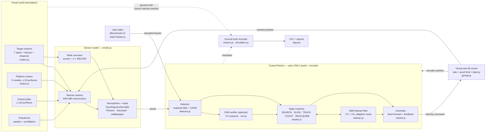

Design rules that the code enforces:

1. **The tracker never sees ground truth.** Its only inputs are the frame(s), the gimbal encoder position and the clock
   (a unit test asserts the exact key set `cam,dt,fps,getOverview,k,narrow,scale,t`).
2. **Simulation time is frame-locked** (`dt = 1/fps`); timing metrics (acquisition, re-acquisition) use simulation time,
   performance metrics (FPS, ms/frame) use wall-clock time around the tracker only.
3. **Deterministic:** every subsystem has its own seeded random stream; the same seed gives a bit-identical log.
4. **The engine has no DOM dependency**, so the same code runs in the browser, in Node (tests, benchmarks) and in Electron.

### 3.2 Module dependency graph

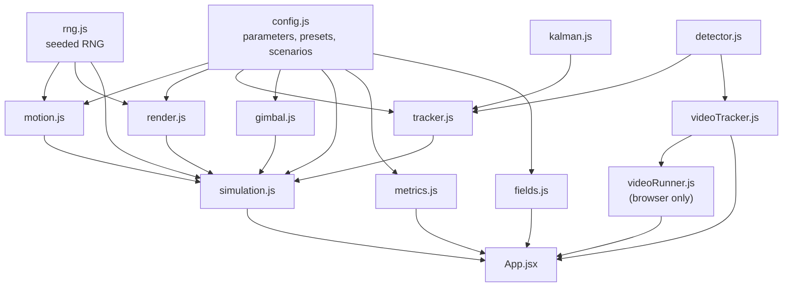

### 3.3 Runtime targets

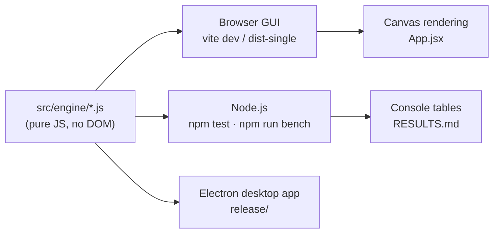

---

## 4. Repository layout

```
tracking-app/
├── src/
│   ├── engine/                 ← the whole tracking system (no DOM, runs anywhere)
│   │   ├── config.js           all parameters + defaults + ranges, atmosphere presets, 15 scenarios, camScale()
│   │   ├── rng.js              seeded random streams (mulberry32 + splitmix), Gaussian, Poisson
│   │   ├── motion.js           target motions (7), platform motions (5), arc-length parameterisation
│   │   ├── render.js           sensor model: beacon rendering, atmosphere, noise, overview frame, colour option
│   │   ├── detector.js         impulse rejection → matched filter → CFAR → validation → sub-pixel centroid
│   │   ├── patch.js            32×32 normalised window extraction (shared by training data and runtime)
│   │   ├── cnn.js              pure-JS inference of the CNN verifier (conv + fc layers)
│   │   ├── ai.js               loads cnnWeights.json (trained by ml/train.py)
│   │   ├── cnnWeights.json     trained weights (700 kB) + training report
│   │   ├── kalman.js           IMM (CV + CA) Kalman filter with adaptive noise
│   │   ├── tracker.js          state machine, acquisition, gating, controller, optional CNN gate
│   │   ├── gimbal.js           pan/tilt mount dynamics
│   │   ├── simulation.js       closed loop + ground-truth recording
│   │   ├── metrics.js          metric definitions, JSON / CSV / HTML report writers
│   │   ├── videoTracker.js     Benchmark-2 tracker for decoded video frames (+ GT parser, video metrics)
│   │   └── videoRunner.js      browser-only: frame-exact .mp4 decoding loop
│   ├── Root.jsx                hash router: "#/" home page, "#/app" workstation
│   ├── Home.jsx, home.css      home page (overview, architecture, innovation, stack, results, compliance)
│   ├── ArchDiagram.jsx         SVG architecture + state-machine diagrams
│   ├── Logo.jsx                Q-Rex logo (also public/favicon.svg)
│   ├── App.jsx                 workstation GUI (toolbar, camera, map, plot, telemetry, benchmark panels)
│   ├── fields.js               declarative description of the parameter panel
│   ├── main.jsx, index.css     React entry (bundled fonts) + workstation styles
│   └── assets/                 (unused leftovers from the Vite template — safe to delete)
├── ml/
│   ├── train.py                CNN training (PyTorch, CPU) → src/engine/cnnWeights.json + ml/report.json
│   ├── export_check.py         dumps reference outputs to check the JS inference numerically
│   └── data/                   generated training data (git-ignored)
├── tests/
│   ├── engine.test.mjs         12 engine tests
│   ├── spec.test.mjs           26 tests, one+ per row of the specification table
│   ├── ai.test.mjs             8 tests: CNN reproduces PyTorch, removes false alarms, closed loop with AI, GT parser
│   ├── zoom.test.mjs           6 tests: zoom-lens acquisition (speed, FOV, no overview sensor, error units)
│   └── fixtures/cnn_reference.json   PyTorch reference outputs
├── scripts/
│   ├── bench.mjs               headless scenario suite (QREX_AI=1 for the CNN ablation)
│   ├── gen-dataset.mjs         simulator → training patches for the CNN
│   ├── eval-ai.mjs             classical vs CNN-verified detector on fresh frames
│   ├── video-robustness.mjs    21 synthetic judge-style videos through the video tracker
│   ├── floor-analysis.mjs      lower-bound experiment for jitter + platform
│   ├── e2e-video.cjs           browser end-to-end Benchmark-2 test (ffmpeg + puppeteer)
│   ├── make-demo-video.cjs     records the demo video (puppeteer screencast + ffmpeg)
│   ├── inline-dist.mjs         dist/ → ONE offline HTML file
│   ├── build-exe.mjs           Electron packager driver → release/
│   └── docs-pdf.mjs            docs/*.md → PDF (marked + headless Chromium)
├── desktop/                    Electron shell (main.cjs incl. --selftest, package.json; q-rex.html is generated)
├── .github/workflows/ci.yml    builds + smoke-tests the desktop app on Windows / macOS / Linux runners
├── demo/q-rex-demo.mp4         the recorded demo video
├── docs/                       technical report, user manual, traceability matrix, demo script, mentor questions (.md + .pdf)
├── dist/                       Vite build output (git-ignored)
├── dist-single/q-rex.html      the single-file offline build (≈ 1 MB with fonts and CNN weights)
├── release/                    packaged desktop apps (≈ 650 MB, git-ignored) — see §15
├── RESULTS.md                  benchmark table of the final code
├── index.html, vite.config.js  Vite entry (base './', assets inlined so builds work from any folder, offline)
├── package.json                scripts + dependencies
└── .gitignore
```

---

## 5. How one frame is processed

`Simulation.step()` advances the world by exactly one frame (`dt = 1/30 s`):

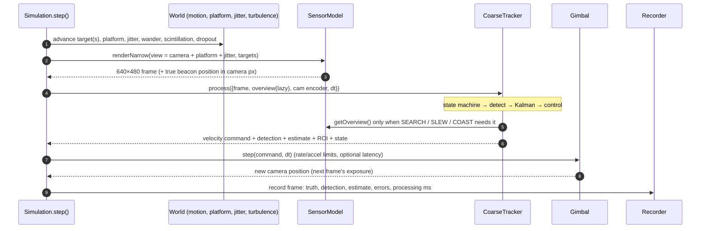

Important details:

* The command computed from frame *k* acts during the interval *k → k+1*, so there is a natural one-frame latency;
  the controller aims at the **latency-compensated prediction** (`predictAhead(dt)`).
* **Jitter and platform motion shift the line of sight** (`view = camera + platform + jitter`). The tracker only sees
  the shifted image; it knows its encoder position but **not** the platform offset.
* The **overview frame** is rendered lazily (only if the tracker asks for it) and rides on the same platform as the
  narrow camera, so both measure target − platform in the same coordinates.

---

## 6. Module reference

### `config.js`
Single source of truth. Exports `DEFAULTS`, `clampConfig()` (clamps every value to the specification range),
`camScale(cfg)` = screen px per camera px = `fovX·160/camW` (1.0 at 640 px / 4°), `PPD = 160` (screen px per degree),
`MOTIONS`, `ATMOSPHERES`, `PLATFORM_MODELS` and `SCENARIOS` (15 named scenarios used by the GUI suite and the benchmark).

### `rng.js`
`RNG(seed, stream)`: independent streams per subsystem (`mulberry32` seeded through `splitmix32`).
`next()`, `uniform()`, `gauss()` (Box–Muller with cached spare), `poisson(λ)` (Knuth for λ ≤ 12, normal approximation above).

### `motion.js`
* **Target motions** (`makeTargetMotion`): `linear`, `circular`, `figure8`, `random`, `spiral`, `sinusoidal`, `waypoints`.
  * Curves are **re-parameterised by arc length** (`ArcPath`): the configured speed in px/s is exact.
  * `linear` / `random` turn away from walls on constant-radius arcs with a ramped turn rate (no velocity jumps).
  * `random` = heading rate follows an Ornstein–Uhlenbeck process (smooth, bounded acceleration).
  * `waypoints` = closed Catmull-Rom spline through the user's points (rounded corners → physically trackable).
  * "Initial location": random, or user-defined (start point for linear/random, **path centre** for parametric paths).
* **Platform motion** (`makePlatformMotion`): `linear` (default), `circular`, `random`, `spiral`, `figure8`; per-frame
  displacement never exceeds `platformSpeed` px/frame (≤ 20); bounded to ±400 px; speed/on-off are read live.

### `render.js` — the sensor model
* **Beacon**: exact pixel integral of a Gaussian-blurred box (antiderivative of the normal CDF), so sub-pixel motion is
  faithful. Circle/diamond use a 4× supersampled mask, Gaussian blurred.
* **PSF** σ = √(0.5² + atmosphere blur² + (1.2·turbulence)²).
* **Atmosphere**: `I' = C·I + B` (contrast/brightness) + blur + rain streaks, interpolated from clear by *severity*.
* **Noise order**: Poisson → Gaussian → salt & pepper → clip to 0…255.
* **Overview frame**: scene ÷ 4 (500×500); noise drawn from the *binned-pixel statistics* (variance ÷ 16) for speed.
* **Colour camera** (optional): three independently-noisy channels (reddish beacon, bluish-grey background); the tracker
  receives the luminance `0.299R + 0.587G + 0.114B`.

### `detector.js` — see [§7.1](#71-detection)
### `kalman.js` — see [§7.2](#72-estimation-imm-kalman-filter)
### `tracker.js` — see [§8](#8-tracker-state-machine) and [§7.3](#73-control)

### `gimbal.js`
Velocity-commanded mount. Per axis: command clipped to the rate limit (`maxPanSpeed`/`maxTiltSpeed` × 160 px/°),
velocity change clipped to `maxAccel × dt`, optional command latency queue (`extraLatency` frames). Pointing range is
the screen **plus 450 px** on every side so platform offsets can still be compensated at the screen edge.

### `simulation.js`
Owns the world, sensor, tracker and gimbal; `step()`, `run(seconds)`, `reset(cfg)`, `updateLive(partial)` (change
disturbances/tuning without restarting). Records one object per frame with ground truth, detection, estimate, errors,
processing time, state, saturation flag, jitter and platform offsets.

### `metrics.js`
`computeMetrics(records, cfg, wallSeconds)` → all metrics + K01–K05 pass/fail; `recordsToCSV`, `metricsToHTML`.

### `videoTracker.js` / `videoRunner.js` — see [§12](#12-benchmark-2--video-input)

### `App.jsx` / `fields.js` — see [§11](#11-the-gui)

---

## 7. Algorithms in detail

> Every formula used by the detector, the filter, the controller and the CNN, with the constants the code really uses, is collected in [§20 Mathematics reference](#20-mathematics-reference).

### 7.1 Detection

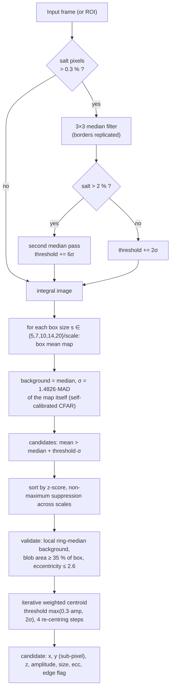

Why each step exists:

* **Switching median (zoomed-out search only):** when the smallest matched box is ≤ 3 px (zoom-lens acquisition, beacon 1–3 px) only pixels sitting at exactly 0 / 255 are replaced, by the median of the non-extreme pixels in their 5×5 neighbourhood. A plain 3×3 median erases such a small beacon; this one keeps it. Video input keeps the plain median because codec smearing makes impulses non-extreme.
* **Median filter** removes impulse noise; it is applied only when salt pixels (≥ 254.5) exceed 0.3 % of a sparse sample,
  because a median would otherwise blur small targets for no reason. Borders are filtered too (an edge salt pixel once
  caused false alarms).
* **Box filter = matched filter** for a flat-topped blob in white noise; five scales cover 5–20 px. The integral image
  makes each scale O(pixels).
* **Self-calibrated CFAR:** per scale, background and noise level are the median and MAD of the box-filter output
  itself. This automatically absorbs correlated noise, clipping at 0, and the noise-type mix — the detector needs no
  knowledge of the noise model. Threshold default 6σ.
* **Validation:** the thresholded blob must fill ≥ 35 % of its matched box (surviving impulse pixels fail this) and
  must not be streak-like (rain).
* **Centroid:** local background from a ring median (works on non-flat video backgrounds); weights `max(0, v − bg − τ)`
  with `τ = min(0.6·A, max(0.3·A, 2σ))`; re-centred 4 times. Measured RMSE 0.02–0.2 px.
* **ROI mode:** in tracking only a window around the prediction (half-width 64–160 px) is processed.

### 7.2 Estimation (IMM Kalman filter)

State per axis `[position, velocity, acceleration]`; x and y are decoupled but share model probabilities.

| Model | Dynamics | Process noise (PSD) |
|---|---|---|
| CV — constant velocity | acceleration forced to 0 | white acceleration, `q = 2·10⁴ px²/s³` |
| CA — constant acceleration | acceleration persists | white jerk, `q = 5·10⁷ px²/s⁵` |

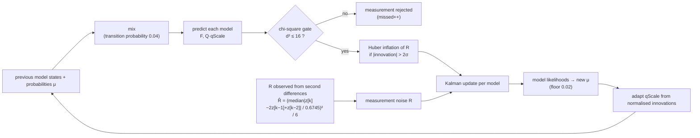

* **Measurements are world positions:** `encoder position + (centroid − image centre)·camScale`. The filter therefore
  tracks *target minus platform* directly.
* **Measurement noise is observable:** for a smooth trajectory `var(z[k] − 2z[k−1] + z[k−2]) = 6R`, so jitter level is
  learned online (median absolute deviation, robust to outliers) without a motion model. The detector's own SNR-based
  σ acts as the floor.
* **Process-noise adaptation:** `qScale ∈ [0.02, 1]`. Two consecutive normalised innovations above the 1 % level
  (NIS > 4.5) → ×1.8 immediately (manoeuvre); mean NIS > 1.4 → ×1.2; mean NIS < 0.8 → ×0.97 per frame. This makes the
  filter loose on manoeuvres and tight on steady motion.
* `predictAhead(τ)` extrapolates the combined state; the acceleration term is weighted by the CA-model probability.

### 7.3 Control

Per axis, with `p` = encoder position and `x̂_aim = predictAhead(dt·(1 + extraLatency))`:

```
d   = x̂_aim − p
u   = g · d/dt + (1 − g) · v̂              g = controlGain (0.6: the extra smoothing beyond the Kalman filter lowers the pointing error under jitter)
rel = u − v̂
limit |rel| ≤ √(2 · 0.85·a_max · |d|)      (minimum-time stopping profile, avoids overshoot)
```

The gimbal then enforces the rate limit and acceleration limit. In COAST the velocity feed-forward decays linearly to
zero so the camera does not run away along a stale trajectory.

### 7.4 Acquisition: three modes

A fixed 4°×3° camera covers only **7.7 %** of the 2000×2000 screen. A boustrophedon scan needs ≥ 5 swaths × 2000 px ÷ 800 px/s ≈ **12.5 s**,
so "acquisition ≤ 2 s" cannot be met by sweeping. Because the statement lists the **FOV as user-defined**, there are two ways to see the
whole scene during search; both are implemented and selectable (*Tracker → Acquisition*):

| Mode (`acquisition`) | How it searches | Result (3 seeds × 20 s) |
|---|---|---|
| **Wide-view overview** (`overview`, default) | an extra 4×-binned view of the whole screen, used **only** while searching / re-acquiring; the narrow camera tracks | acquisition 0.5–0.8 s (1.87 s with a 20 px/frame platform) |
| **Zoom lens** (`zoom`) | the **same camera** starts at the full-screen FOV (≈ 16.7°, so the 4:3 frame covers the square screen), detects, then narrows its FOV at `zoomRate` (12 °/s) while centring; widens again while the beacon is missing | first confirmed detection **0.03 s**; beacon centred at the configured 4°×3° FOV in **≤ 1.23 s** in every A/B scenario (incl. salt & pepper 10 %), platform 20 px/frame ≤ 1.5 s |
| **Raster scan** (`scan`) | fixed-FOV boustrophedon sweep | ≈ 5–13 s: cannot meet 2 s |

Zoom-mode details: the tracker receives the lens's current scale each frame, so matched-filter box sizes, ROI windows, measurement noise and
the zoom controller (`tracker._zoomTarget`: keep the beacon inside the frame with a margin of 60 px + 4σ, zoom in only as fast as the pointing
error allows, zoom out again in COAST) all follow it; errors are always reported in pixels of the *configured* FOV; camera shake and beam wander are
angular (independent of the zoom). If nothing is seen for 2 s (e.g. a sub-pixel beacon buried in impulse noise) it zooms to a mid FOV and scans.
Under 10 % salt & pepper the zoomed-out beacon is only 1–3 px; the **switching median** (§7.1) keeps it, so detection is still 0.03 s and the beacon is centred at 4°×3° in ≤ 1.07 s (8 of 8 seeds, also with Gaussian σ = 20). In the all-disturbances scenario (C1) zoom mode locks on 99.9 % of frames but one seed needs 2.10 s to first detect (K01) and the error is 10.8 px (K02). Which interpretation the organisers accept (extra wide sensor or zoom lens) is an open question (`docs/MENTOR_QUESTIONS.md`).

### 7.5 Learned verifier (CNN) — the trained part of the system

A 73 867-parameter convolutional network (v4, trained on CPU; the build machine has no usable GPU driver, so GPU training is planned - see the roadmap, §19) that looks at a **32×32 window around each detector candidate** and answers two
questions: *is this a beacon?* (probability) and *where exactly?* (sub-pixel offset).

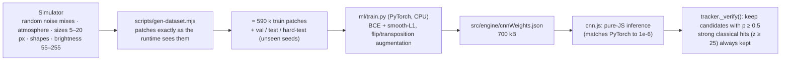

* **Architecture:** conv3×3(1→16) → conv3×3/2(16→24) → conv3×3/2(24→32) → conv3×3/2(32→48) → FC(768→64) → FC(64→3: logit, dx, dy); ReLU; ≈ 1.7 M MACs per window (v1/v2 used a 37 k-parameter variant of half the width).
* **Input normalisation:** window sampled (bilinear) from the detector's impulse-filtered image, `asinh((v − background) / (3σ))` with the frame's robust background and noise level.
* **Training data (generated by the simulator, never from judges' data):** positives are real classical candidates on beacon frames plus random-offset windows (so the offset head learns its full ±6 px range); negatives are the detector's **own false alarms on beacon-free frames at a low threshold** (the hardest ones), plus random windows. Splits use disjoint seeds; a *hard test* set uses only foggy / low-light / σ ≥ 14 conditions with faint beacons.
* **Held-out results:** test accuracy 99.39 %, AUC 0.9987, offset RMSE 0.45 px; hard test 97.4 % (true-positive rate 91.1 %, false-positive rate 0.4 %; v3 on the same set: 97.0 % / 89.0 %), codec test 99.6 % (false-positive rate 0.6 %), zoomed-out (wide-FOV) test 98.5 % (true-positive rate 95.7 %). The test sets now also contain zoomed-out and video-codec patches, so the numbers are not comparable with v2's easier set. Zoomed-out beacon recall rose from about 70 % (v2) to 99 % in the detector ablation, codec-induced false alarms fell from 10-14 % to 0 %, and (v4) very faint beacons in fog are now recalled as well as by the classical detector (93 % vs 93 %; v3 lost 6 points). Remaining limit: on zoomed-out low-light + Poisson frames the verified detector hits 78 % against 91 % for the classical detector alone, but with 1 % instead of 82 % false-alarm frames.
* **Measured effect inside the detector** (`npm run ai:eval`, fresh frames, 120 per condition; "FA" = empty frame produced a candidate):

| Condition | classical T=6: hit / FA | classical T=6 **+ CNN**: hit / FA |
|---|---|---|
| clean · Gaussian σ20 · fog σ20 · faint I=90 | 100 % / 0–1 % | 100 % / 0 % |
| salt & pepper 10 % + σ20 | 100 % / 0 % (after the median-filter fix, see below) | 100 % / 0 % |
| low light + Poisson + σ12 | 100 % / **10 %** | 100 % / **0 %** |
| rain + σ15 (streaks) | 100 % / **11 %** | 100 % / **0 %** |
| very faint beacon (I=70) in fog σ12 | **93 %** / 0 % | 93 % / 0 % |
| zoomed-out 16.7° low light + Poisson | 91 % / **82 %** | 78 % / **1 %** |
| compressed video (q20-30) + noise, rain, 10 % S&P | 100 % / **2–14 %** | 100 % / **0–2 %** |

* **Honest conclusions:** the CNN's value is **false-alarm suppression on low-light + Poisson and rain frames** (10–11 % → 0 % on empty frames). On salt & pepper the classical detector had 10 % false alarms only because of a faulty 3×3 median (a sorting-network bug, found and fixed later; the classical detector is now at 0 % there, so the CNN adds nothing for impulse noise). The remaining benefit matters for full-frame search (scan mode, video input). It does **not** improve centroid accuracy (the classical centroid is as good or better, so the offset head is off by default: `aiRefine = false`) and, since v4, it no longer loses faint beacons in fog (93 % = classical; v3 lost 6 points) but still loses hits on zoomed-out low-light frames (91 % → 78 %, with 82 % → 1 % false alarms). It therefore ships as an **optional gate (`aiVerifier`, default off)** with two safeguards: a very strong classical detection (z ≥ 25) is never vetoed, and the classical path is always the fallback. Enable it in *Tracker → AI verifier* or for videos with *AI verifier (CNN)* in Benchmark 2.
* **Domain-gap caution:** the network was trained on simulator patches only; on real recorded video it may disagree with the classical detector. That is why it is optional and why strong classical hits override it.

---

## 8. Tracker state machine

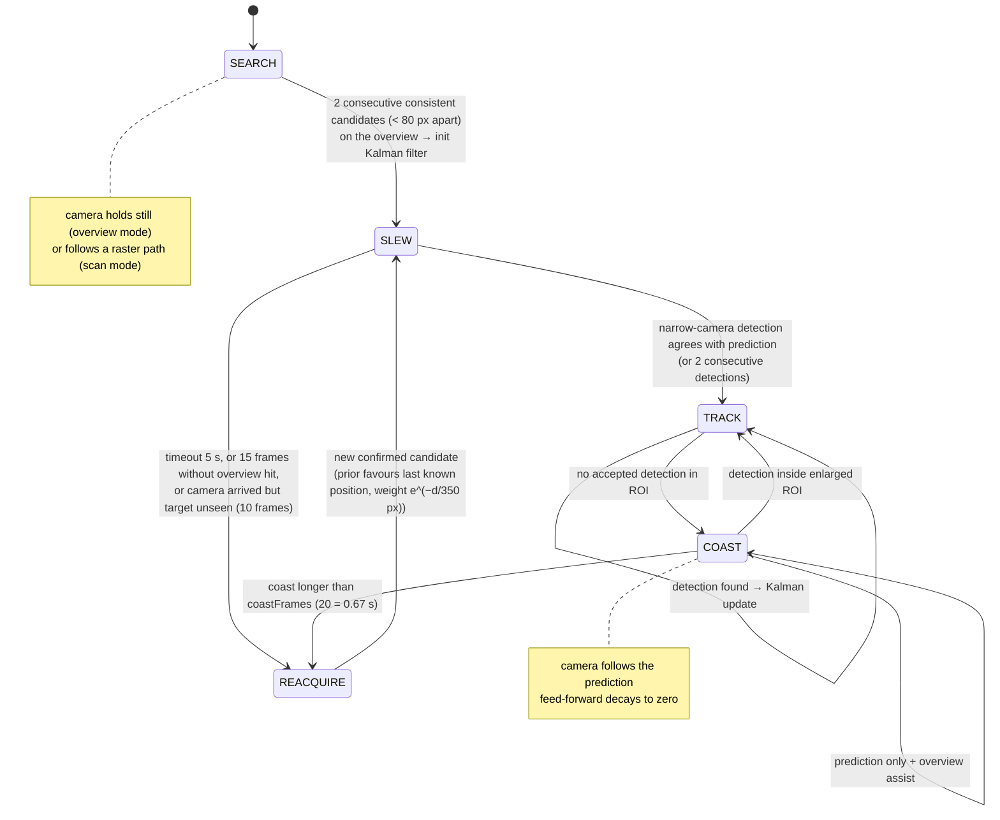

* **Identification / decoys:** the designated beacon is the strongest candidate at first lock; afterwards candidates
  are accepted only if they are nearest to the predicted position within a gate, so decoys cannot steal the lock.
* **Hysteresis:** 2 consecutive consistent candidates are required to leave SEARCH; the slew timeout and the
  "arrived-but-unseen" exit prevent deadlock.
* **Search window sizes:** SLEW ROI radius 70–200 px; TRACK 64–160 px (grows with filter uncertainty and speed);
  COAST up to the whole frame.

---

## 9. Configuration reference

All values are clamped by `clampConfig()`. Defaults in **bold**. "Spec" = row number of the specification table.

### Camera
| Key | Default | Range | Spec | Meaning |
|---|---|---|---|---|
| `screenSize` | **2000** | 2000–6000 | 1 | square screen, px |
| `cameraType` | **mono** | mono, colour | 2 | tracker uses luminance |
| `camW`, `camH` | **640**, **480** | 160–1280, 120–960 | 3 | camera resolution |
| `fovX` | **4**° | 1–12° | 4 | horizontal FOV (vertical = fovX·camH/camW → 3°) |
| `fps` | **30** | 30–120 | 5, 15 | camera and control rate |
| `maxPanSpeed`, `maxTiltSpeed` | **5**, **5** °/s | 5–10 | 13, 14 | rate limits |
| `maxAccel` | **60** °/s² | 5–100 | — | gimbal acceleration (**not in the spec**; 20 and 100 are reported in §14) |
| `extraLatency` | **0** frames | 0–4 | — | additional command latency |

### Target
| Key | Default | Range | Spec |
|---|---|---|---|
| `numTargets` | **1** | 1–6 (extra = decoys) | 8 |
| `targetShape` | **square** | square, circle, diamond | 9 |
| `targetSize` | **10** px | 5–20 | 10 |
| `targetIntensity` | **230** | grey level | — |
| `startMode`, `startX`, `startY` | **random** | random / user | 11 |
| `motion` | **circular** | linear, circular, figure8, random, spiral, sinusoidal, waypoints | 12 |
| `targetSpeed` | **200** px/s | 20–700 | — |
| `waypoints` | 4 sample points | `x,y` per line | 12 |

### Disturbances
| Key | Default | Range | Spec |
|---|---|---|---|
| `saltPepper`, `saltPepperDensity` | off, **0.10** | 0–0.10 | 21.1 |
| `gaussian`, `gaussianSigma` | off, **10** | σ 0–20 grey levels | 21.1, 21.2 |
| `poisson` | off | on/off | 21.1 |
| `jitter`, `jitterMax` | off, **10** px/frame | 0–20 | 21.3 |
| `atmosphere`, `atmosphereLevel` | **clear**, 1.0 | clear, haze, fog, rain, lowlight; 0–1 | 21.4 |
| `platform`, `platformModel`, `platformSpeed` | off, **linear**, **10** px/frame | linear, circular, random, spiral, figure8; 0–20 | 21.5 |
| `turbulence` | **0** | 0–1 | — |
| `dropout`, `dropoutEvery`, `dropoutLen` | off, 6 s, 0.5 s | — | re-acquisition test aid |
| `background` | **20** | grey level | — |

Atmosphere presets (`I' = C·I + B`, plus blur): haze C 0.70 B +18 blur 1.0 · fog 0.45 / +35 / 2.0 · rain 0.75 / +5 / 0.8
+ streaks · low light 0.35 / −5 / shot-noise ×3.

### Tracker
| Key | Default | Range |
|---|---|---|
| `acquisition` | **overview** | overview, zoom, scan |
| `zoomRate` | **12** °/s | 3–60 (zoom mode) |
| `controlGain` | **0.6** | 0.2–1 |
| `detectThreshold` | **6** σ | 4–10 |
| `coastFrames` | **20** | 3–90 |
| `seed` | **1** | any |
| `duration` | **30** s | 0 = endless |

*Noise σ:* the statement says "20 pixels"; it is interpreted as **20 grey levels** on a 0–255 scale.

### Built-in scenarios (`SCENARIOS`)
A1 nominal · A2 straight line · A3 figure-8 · A4 random · B1 Gaussian σ=20 · B2 salt & pepper 10 % · B3 Poisson ·
B4 jitter ±20 · B5 platform 20 px/frame · B6 fog · B7 rain · B8 low light · B10 beacon dropouts · B9 decoys ·
C1 every disturbance at its maximum.

---

## 10. Metrics and the performance log

Exact definitions (also in `docs/TECHNICAL_REPORT.md`):

| Metric | Definition |
|---|---|
| **Tracking (boresight) error** | distance of the *true* beacon from the image centre, **excluding** the random per-frame jitter that the camera itself suffers (also reported including jitter). Steady-state window: from the first frame within 10 px after lock; only frames where the beacon is inside the FOV |
| **Centroiding error** | detector centroid vs true beacon position in the same frame — mean, RMSE, P95, max |
| **Acquisition time** | simulation time from start to the first confirmed TRACK inside the narrow FOV (`timeToCentreSec` = first frame ≤ 10 px) |
| **Target loss %** | frames since first lock where the beacon is outside the FOV ÷ all frames since first lock |
| **Lock retention %** | frames in TRACK/COAST with beacon in FOV and estimate within 60 px ÷ frames since first lock |
| **Re-acquisition time** | time from leaving TRACK to the next TRACK; maximum over all events |
| **FPS / processing time** | wall-clock of tracker + controller per frame (scene rendering excluded); `endToEndFPS` also logged |
| **Gimbal saturation %** | frames where the command exceeded the rate limit |

**Spec checks** reported in every run: K01 acquisition ≤ 2 s · K02 mean tracking error ≤ 10 px ·
K03 target loss < 5 % · K04 re-acquisition ≤ 1 s · K05 ≥ 20 FPS.

**Automatic performance log:** at the end of a timed run the GUI downloads `performance_report.json`,
`performance_report.html` and `tracking_log.csv` (one row per frame: truth, detection, estimate, all errors, state,
processing time, jitter and platform offsets). Buttons export the same files at any time. The JSON also contains the
complete configuration, so a run can be reproduced from its seed.

Report fields: `simulationDurationSec`, `framesProcessed`, `averageFPS`, `endToEndFPS`, `processingTimeMeanMs/P95Ms/MaxMs`,
`acquisitionTimeSec`, `timeToCentreSec`, `trackingErrorMeanPx/RmsePx/P95Px/P99Px/MaxPx`, `trackingErrorInclJitterMeanPx`,
`centroidingErrorMeanPx/RmsePx/P95Px/MaxPx`, `lockRetentionRatePct`, `targetLossPct`, `reacquisitionEvents`,
`reacquisitionDeclaredLosses`, `reacquisitionTimeMeanSec/MaxSec`, `gimbalSaturationPct`, `checks`, `passAll`, `config`.

---

## 11. The GUI

The app opens on the **home page** (`#/`): hero with a live tracking illustration, executive overview, specification-vs-measured
table, architecture diagrams, innovation tiles, tech-stack table, benchmark results with a test log, evaluation mapping and the
honest limits. **Launch Workstation** (`#/app`) opens the workstation; its sidebar has a *← Home / overview* link.

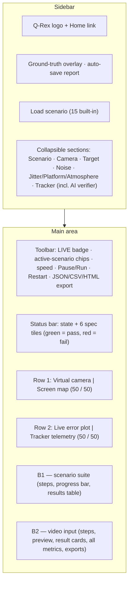

* **Live vs restart:** disturbance and tracker controls apply **live** (`Simulation.updateLive`); scene/camera/target controls restart the run.
* **Camera view:** red cross = boresight · green square = detection · yellow circle = filter estimate · cyan dashed box = search ROI · magenta circle = ground truth (toggle). Shown at ≤ native 640 px, never enlarged, so it stays sharp.
* **Screen map:** the 2000×2000 screen drawn as a true square; blue box = camera footprint, magenta trail + dot = beacon, green circle = estimate.
* **Live error:** boresight error of the last 300 frames with the 10 px spec band; the line starts once the beacon is first centred (the slew-in is shown by the state strip), auto-scaling y-axis, "now" and "mean (locked)" readouts.
* **Telemetry:** state, sensing mode, camera pointing, beacon speed, CV/CA model mix, filter σ, learned measurement noise, search window, processing time, gimbal saturation.
* **Endless runs** (`duration = 0`): with *auto-save* on, the full log (JSON, HTML, CSV) is downloaded every 60 s of simulated time, and closing the window with unsaved frames asks for confirmation.
* **Main loop:** `requestAnimationFrame` with an accumulator at `fps × speed`; "max" runs as many frames as fit in a time budget.
* **Warning banner** when target speed + platform speed exceeds the gimbal limit.

---

## 12. Benchmark 2 — video input

The evaluator supplies `.mp4` files @ 30 fps covering the complete screen; the software must **bypass the PTZ camera**
and use the video as input.

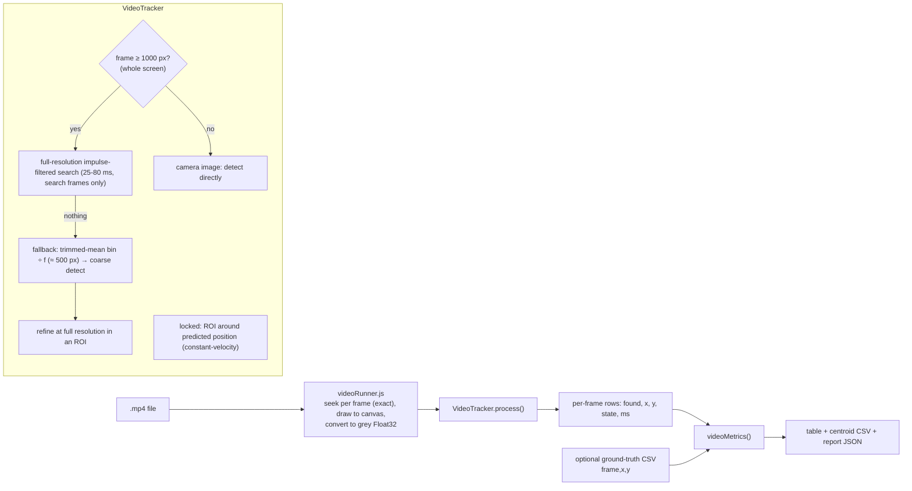

* Same `Detector` as the live system. Confirmation needs 2 consistent detections (< 60 px apart); lock is dropped after
  15 missed frames; candidates in search are weighted by `e^(−d/350)` toward the last position. Inside the tracking window the
  winner is the candidate with the best SNR weighted by closeness to the predicted position (a fast beacon can be 40 px away
  from the prediction while a static noise blob sits next to it); the coast prediction decays and stays inside the frame; a
  beacon that was already faint (smoothed z < 25) gets a lower-threshold retry in a tight gate. The coarse fallback uses a
  trimmed block mean so salt & pepper does not leak into the down-sampled image.
* **Ground-truth CSV:** rows `frame,x,y` or `time_s,x,y` (comma / semicolon / tab / space separated, header optional, extra columns ignored); 0- or 1-based frame numbers are auto-detected, non-integer first columns are read as seconds. A selector switches between *pixel index* (centre of first pixel = 0) and *pixel edge* (= 0.5) conventions.
* **AI verifier (CNN)** checkbox applies the learned gate to the search and tracking windows of the video tracker.
* Output coordinates use the **OpenCV pixel-index convention** (centre of the first pixel = 0.0); ground truth must use
  the same convention. Centroid CSV columns: `frame,t,found,x,y,state,procMs`.
* Metrics: frames, frame size, duration, FPS, acquisition time, lock retention, re-acquisition events/time, and — with
  ground truth — centroiding error mean / RMSE / P95 / max.
* Verified end-to-end (`npm run e2e`): 2000×2000 H.264 video, noise σ≈12, exact ground truth → acquisition 0.033 s,
  lock 100 %, centroid RMSE 0.072 px.
* Any resolution, aspect, fps, colour format is accepted (colour is converted to grey).

---

## 13. Testing

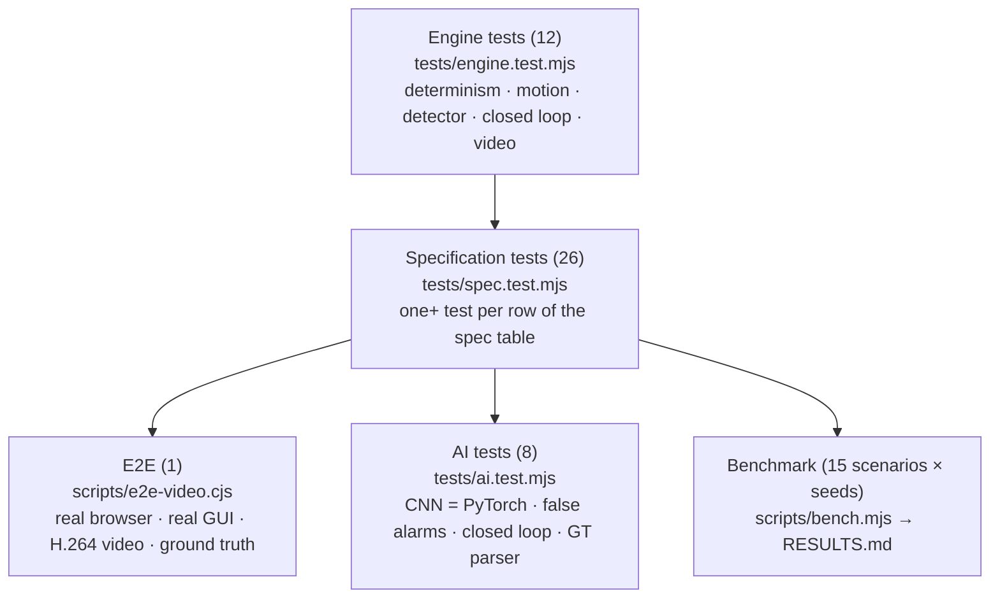

`npm test` runs 54 tests in ≈ 4 min.

| File | What it proves |
|---|---|
| `engine.test.mjs` | RNG determinism; config clamping; all 7 motions stay on screen at the configured speed (±6 %); platform step ≤ 20 px/frame for all 5 models; sub-pixel centroid under Gaussian σ 20, salt & pepper, fog (sizes 5/10/20); false-alarm rate on empty noisy frames; nominal closed loop passes; same seed ⇒ identical logs; scan acquisition; decoy rejection; video tracker on synthetic 2000×2000 stream; defaults equal the spec |
| `spec.test.mjs` | rows 1–21 of the specification table: screen size, mono + colour camera, resolution, FOV (2°/8°), update rate, initial camera position, target count, shapes, sizes, initial location, all motions, 5 & 10 °/s limits really enforced, control rate, acquisition / error / loss / re-acquisition / FPS on the four mandatory motions, re-acquisition after the camera is knocked 450 px off and after 0.5 s dropouts, every noise type and combination, σ ≈ 20 really applied, jitter bounded at ±20, atmosphere reduces contrast and is survivable, all 5 platform models, turbulence, decoys, performance-log fields, "ground truth never reaches the tracker" |
| `ai.test.mjs` | JS inference reproduces PyTorch outputs (< 1e-3); training report thresholds; CNN gate leaves ≤ 1/20 false alarms and keeps ≥ 19/20 beacons under S&P / low light / rain; closed loop passes with the verifier on (nominal, S&P + σ20, rain + decoys); scan acquisition with the verifier; video tracker with the verifier; ground-truth parser (header, separators, 1-based frames, seconds, extra columns) and the pixel-edge convention |
| `e2e-video.cjs` | needs `ffmpeg`, Chromium (`/usr/bin/chromium`) and a **global** `puppeteer` (`npm i -g puppeteer`): synthesises the video, uploads it with its ground-truth CSV through the GUI, asserts RMSE < 1 px, lock ≥ 99 %, acquisition ≤ 0.2 s |
| `bench.mjs` | `node scripts/bench.mjs [seeds] [seconds] [scenario-filter]` — table of all metrics + pass counts |

Two example bugs the tests found: the mount saturated at the screen edge when the platform shifted the view (fixed by the
±450 px pointing range), and the filter froze after long straight runs then lost the target at wall turns (fixed by the
fast manoeuvre rule in the process-noise adaptation).

---

## 14. Results

Final code, default wide-view acquisition, gimbal acceleration 60 °/s², 3 seeds × 20 s per scenario (`npm run bench -- 3 20`; full output in [`RESULTS.md`](RESULTS.md)).
"Acq" = first confirmed detection / lock; "centred" = beacon within 10 px at the configured FOV:

| Scenario | Acq s (mean (max)) | Centred s | Err px | Cent RMSE px | Loss % | Lock % | Re-acq s | ms/frame | Pass |
|---|---|---|---|---|---|---|---|---|---|
| A1 Nominal (circular) | 0.54(0.80) | 0.87(1.07) | 0.6 | 0.05 | 0.0 | 100.0 | 0.00 | 3.4 | 3/3 |
| A2 Straight line | 0.57(0.87) | 1.01(1.23) | 0.1 | 0.03 | 0.0 | 100.0 | 0.00 | 3.6 | 3/3 |
| A3 Figure of 8 | 0.56(0.73) | 1.00(1.13) | 0.4 | 0.06 | 0.0 | 100.0 | 0.00 | 3.1 | 3/3 |
| A4 Random walk | 0.50(0.73) | 0.92(1.10) | 0.4 | 0.05 | 0.0 | 100.0 | 0.03 | 3.1 | 3/3 |
| B1 Gaussian noise σ=20 | 0.53(0.77) | 0.87(1.07) | 1.2 | 0.19 | 0.1 | 99.9 | 0.00 | 9.1 | 3/3 |
| B2 Salt & pepper 10% | 0.54(0.80) | 0.87(1.07) | 0.6 | 0.10 | 0.0 | 100.0 | 0.00 | 5.9 | 3/3 |
| B3 Poisson noise | 0.54(0.80) | 0.87(1.07) | 1.1 | 0.06 | 0.0 | 100.0 | 0.00 | 6.6 | 3/3 |
| B4 Jitter ±20 px/frame | 0.56(0.80) | 0.89(1.07) | 6.3 | 0.04 | 0.0 | 100.0 | 0.00 | 2.7 | 3/3 |
| B5 Platform 20 px/frame | 1.17(1.87) | 1.53(2.17) | 1.0 | 0.04 | 0.0 | 100.0 | 0.03 | 2.0 | 3/3 |
| B6 Fog | 0.54(0.80) | 0.87(1.07) | 0.6 | 0.03 | 0.0 | 100.0 | 0.00 | 3.3 | 3/3 |
| B7 Rain | 0.54(0.80) | 0.87(1.07) | 0.6 | 0.04 | 0.0 | 100.0 | 0.00 | 3.5 | 3/3 |
| B8 Low light | 0.54(0.80) | 0.87(1.07) | 0.7 | 0.05 | 0.0 | 100.0 | 0.00 | 3.4 | 3/3 |
| B10 Beacon dropouts (0.5 s) | 0.54(0.80) | 0.87(1.07) | 1.1 | 0.05 | 0.0 | 100.0 | 0.50 | 4.3 | 3/3 |
| B9 Decoys (3 targets) | 0.54(0.80) | 0.87(1.07) | 0.6 | 0.05 | 0.0 | 100.0 | 0.00 | 3.4 | 3/3 |
| C1 All disturbances (max) | 1.16(1.87) | 1.64(2.27) | 10.8 | 0.21 | 0.1 | 99.9 | 0.03 | 17.5 | 0/3 |

**Gimbal acceleration is not in the specification**, so the tracking error of the hardest cases is reported for three values (`QREX_ACCEL=<°/s²> npm run bench`):

| Max acceleration | B4 jitter ±20 | B5 platform 20 | C1 all disturbances | jitter + platform + target only |
|---|---|---|---|---|
| 20 °/s² (conservative) | 6.6 px | 1.0 px | 14.3 px | 14.2 px |
| **60 °/s² (default)** | **6.3 px** | **1.0 px** | **10.8 px** | **10.7 px** |
| 100 °/s² | 6.3 px | 1.0 px | 10.6 px | 10.4 px |

At 100 °/s² the combined case reaches the 10.4 px bound of `scripts/floor-analysis.mjs`; it cannot go below it.

**Camera-only zoom acquisition** (`QREX_ACQ=zoom npm run bench -- 3 20`): detection 0.03 s and the beacon centred at 4°×3° in 1.07–1.12 s (max 1.23 s) for A1–A4 and B1–B10 including **salt & pepper 10 %**; platform 1.31 s (max 1.50 s). C1 (all disturbances): detection 0.73 s mean / 2.10 s max, centred 2.10 s (max 3.03 s), error 10.8 px, lock 99.9 % — K01 and K02 fail.

**Closed-loop ablation with the CNN verifier on** (`QREX_AI=1 npm run bench -- 3 20`): all 12 tested scenarios (nominal, random, Gaussian,
salt & pepper, Poisson, fog, rain, low light, decoys, dropouts, jitter, platform) give **identical pass/fail and the same error, loss and
acquisition numbers** as the classical detector (3/3 seeds each). The verifier only adds processing time (≈ +4–6 ms per frame; still ≈ 100 FPS). In
closed loop the prediction gate already hides detector false alarms, so the verifier's measurable benefit is confined to full-frame searches
(raster-scan mode, video input) — see §7.5.

---

## 15. Build, packaging and the `release/` folder

### What `release/` is

`release/` is the **output of `npm run build:exe`**: a ready-to-run **native desktop application**, produced by
[`@electron/packager`](https://github.com/electron/packager). It is the "standalone executable" the problem statement asks
for. Each sub-folder is one platform:

```
release/
├── q-rex-linux-x64/        ← run  ./q-rex
│   ├── q-rex               the executable (Electron runtime + our app)
│   ├── resources/app.asar  our code: main.cjs + the single-file q-rex.html
│   └── *.so, *.pak, …      Chromium / Electron runtime files
└── q-rex-win32-x64/        ← run  q-rex.exe   (copy the whole folder to a Windows PC)
    └── q-rex.exe …
```

* It is **large (~280–350 MB per platform)** because every copy bundles a full Chromium + Node runtime — that is how Electron
  makes an app run with **no installation and no internet**.
* It is **a build artifact**, not source: it is git-ignored and can be rebuilt at any time. **Do not commit it.**
  To share it, zip each platform folder and attach it to a GitHub *Release* (or any file share).
* To run: copy the whole `q-rex-<platform>/` folder to the target machine and start `q-rex` / `q-rex.exe`. The
  application is the same GUI as the browser version.
* Only the Linux build has been launched during development; the Windows build was packaged but not run.

### Build pipeline

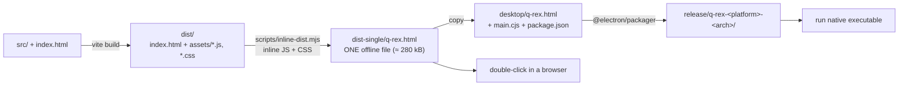

Commands:

```bash
npm run build:single                 # dist-single/q-rex.html
npm run build:exe                    # release/ for the current OS / arch
node scripts/build-exe.mjs win32 x64 # cross-package for Windows (also darwin, linux; arch x64 / arm64)
```

`desktop/main.cjs` is the whole Electron shell: it creates one 1500×950 window, hides the menu, disables background
throttling (so the simulation keeps real-time pacing) and loads `q-rex.html`.

### Which output do I use?

| Output | Size | Needs | Use for |
|---|---|---|---|
| `npm run dev` | — | Node + npm | development |
| `dist-single/q-rex.html` | 280 kB | a browser | quick demo, e-mailing, evaluators |
| `release/q-rex-*/` | ~300 MB each | nothing | "standalone executable" deliverable |

---

## 16. Recreating this project from scratch

1. **Scaffold**
   ```bash
   npm create vite@latest tracking-app -- --template react
   cd tracking-app
   npm i
   npm i -D electron @electron/packager marked oxlint
   ```
   Set `"type": "module"` and the scripts from [§2](#2-quick-start-and-how-to-run) in `package.json`; in `vite.config.js` use
   `base: './'` with `@vitejs/plugin-react`.
2. **Create `src/engine/`** and write the modules in this order (each is testable on its own; the spec for each is in
   [§6](#6-module-reference) and [§7](#7-algorithms-in-detail)):
   1. `rng.js` → 2. `config.js` → 3. `motion.js` → 4. `render.js` → 5. `detector.js` (test: centroid error vs. noise) →
   6. `kalman.js` → 7. `gimbal.js` → 8. `tracker.js` → 9. `simulation.js` → 10. `metrics.js` →
   11. `videoTracker.js` → 12. `videoRunner.js`.
3. **GUI:** `fields.js` (declarative parameter list), `App.jsx` (canvas drawing, status tiles, benchmark panels),
   `index.css`.
4. **Scripts:** `bench.mjs`, `inline-dist.mjs`, `build-exe.mjs`, `e2e-video.cjs`, `docs-pdf.mjs`; `desktop/main.cjs` and
   `desktop/package.json` (`{"name":"q-rex","main":"main.cjs"}`).
5. **Tests:** `engine.test.mjs`, `spec.test.mjs` with `node --test`.
6. **Verify:** `npm test` → `npm run bench -- 3 20` → `npm run build:single` → `npm run e2e` → `npm run build:exe`.

### Key numbers to reproduce exactly

| Item | Value |
|---|---|
| Pixel scale | 640 px / 4° = **160 px/°**; 2000 px screen = 12.5°; 5°/s = 800 px/s = 26.7 px/frame |
| Beacon | peak 230, background 20, PSF σ₀ = 0.5 px |
| Overview | binning factor 4 → 500×500; box sizes {1,2,3,5} |
| Narrow box sizes | {5, 7, 10, 14, 20} ÷ camScale (≥ 2 px, unique) |
| CFAR threshold | 6σ (+2σ impulse, +6σ dense impulse) |
| Centroid | window radius ⌈s/2 + 4⌉, τ = min(0.6A, max(0.3A, 2σ)), 4 iterations |
| IMM | q_CV 3·10⁴, q_CA 3·10⁷, switch probability 0.04 (initial μ = 0.6/0.4), gate χ² = 16 (a measurement is accepted after 2 rejections in a row), μ floor 0.02, noise prior 4 px until 12 second-difference samples exist |
| qScale | start 0.1; range 0.05–0.4; ×1.8 on 2 consecutive NIS > 4.5; ×1.2 if mean NIS > 1.4; ×0.97 if < 0.8 |
| R estimate | window 60 second-differences, ≥ 12 needed, `R = (median / 0.6745)² / 6` |
| Controller | g = 0.6; braking limit √(2·0.85·a·d) |
| Gimbal | accel default 60°/s² = 9600 px/s² (20 °/s² = 3200 px/s² is the conservative reference); pointing range −450 … size + 450 |
| Jitter | per axis truncated Gaussian σ = J/2.5, clipped ±J |
| Platform | bounded ±400 px; wall turn radius 220 px; turn-rate ramp ≤ 0.012 rad/frame² |
| Target wall turns | radius 300 px, margin 70 px, ramp ≤ 0.02 rad/frame² |
| Lock confirm | 2 consecutive overview hits < 80 px apart; narrow detection within 30 px + 3σ of prediction |
| Timeouts | slew 5 s, no overview hit 15 frames, arrived-but-unseen 10 frames, coast 20 frames |
| Platform spiral | radius 150 → 390 px (smaller radii exceed the mount's acceleration) |

---

## 17. Specification compliance and honest limitations

Full requirement → code → test matrix: [`docs/TRACEABILITY.md`](docs/TRACEABILITY.md). Documents:
[`docs/TECHNICAL_REPORT.pdf`](docs/TECHNICAL_REPORT.pdf), [`docs/USER_MANUAL.pdf`](docs/USER_MANUAL.pdf),
[`docs/DEMO_SCRIPT.md`](docs/DEMO_SCRIPT.md), [`docs/MENTOR_QUESTIONS.md`](docs/MENTOR_QUESTIONS.md), demo video `demo/q-rex-demo.mp4`.

**Closed since the first version:** the optional demo video exists; a trained CNN is part of the system (measured, optional);
endless runs auto-save their log; video ground truth accepts several formats and both pixel conventions; the open questions
are collected for the mentors; the interface, executables and PDFs are rebuilt.

**Not met / only partly met — stated plainly:**

1. **Jitter ±20 px/frame, platform 20 px/frame and all noises at once: 10.8 px mean error (limit 10 px).** `scripts/floor-analysis.mjs` replays the real
   jitter + platform + target sequences through the best causal Kalman filters (orders 1–4, process noise swept): the best filter locates the beacon at the *current*
   frame to 7.3 px, but the camera must be pointed where the beacon *will be* when the next frame is exposed, and the best **one-frame-ahead prediction error is ≈ 10.4 px**
   (raw jitter alone is 9.9 px). After retuning (process-noise bounds, control gain 0.6) the closed loop is within 0.4 px of that bound at 60 °/s² and reaches it at 100 °/s²;
   it cannot go below it, so 10 px is not reachable in this combined case with a causal, one-frame-latency design. Each disturbance alone passes (jitter ±20 alone: 6.3 px).
   The result depends on the gimbal acceleration, which the statement does not specify: 14.3 px at 20 °/s², 10.8 px at 60 °/s² (default), 10.6 px at 100 °/s². (Two earlier
   versions of this document called ≈ 19 px and then a ≈ 15 px figure "fundamental"; both were wrong and have been corrected.)
2. **AI:** the system contains a trained CNN (v4, 74 k parameters), but its benefit is limited and measured: it suppresses false alarms on low-light, rain, zoomed-out and compressed-video frames (10–14 % → 0–2 % on empty frames) and does not improve centroid accuracy. It matches the classical detector on faint beacons in fog but still loses hits on zoomed-out low-light frames (91 % → 78 %). It is optional (default off) with the classical detector as fallback, and it is trained on simulator data only.
3. **Acquisition ≤ 2 s needs a wide view or the zoom lens** (§7.4): both implemented, wide view is the default; the fixed-FOV scan cannot meet it. Both modes meet it in every A/B scenario; in the all-disturbances case one of three seeds needs 2.10 s in zoom mode. Which one the organisers accept is a question for the mentors (`docs/MENTOR_QUESTIONS.md`).
4. **Judges' own files never run:** the Benchmark-1 scenarios and Benchmark-2 videos. To reduce the risk, `scripts/video-robustness.mjs` encodes 21 videos (2000², 1920×1080, 1280×720, 640×480; H.264 crf 18–36, MPEG-4; 25 / 29.97 / 30 fps; Gaussian σ ≤ 20, 10 % salt & pepper; 5–20 px square / circle beacons; dim beacon; bright background; 40 px/frame; blink-out; plus 5 hard cases: crf 45, dim beacon, low contrast + S&P, 640×480 crf 45 + 10 % S&P, 1280×720 dim + S&P) and 20 of 21 meet the pass line (acquisition ≤ 0.04 s, lock ≥ 79.7 % (≤ 86 % possible with the blink), centroid RMSE 0.01–0.76 px); the 21st (dim beacon at crf 36 with 10 % S&P, per-frame SNR ≈ 4–7 after the codec) locks 90 % of frames with 15 px RMSE and stays an informational miss. Loader tolerance on real files is still untested.
   **Windows / macOS executables:** the Windows build is packaged and verified structurally (valid PE32+ executable, correct `app.asar`); `q-rex --selftest` passes on Linux; `.github/workflows/ci.yml` builds and smoke-tests on real Windows, macOS and Linux runners the first time the repo is pushed.
5. **"Noise std 20 pixels"** is interpreted as 20 grey levels (question for the mentors).
6. **Browser-side video decoding** needs a codec the browser supports (H.264 in Chrome / Edge / Electron). One end-to-end video run failed once in six and could not be reproduced.

---

## 18. Troubleshooting

| Problem | Cause / fix |
|---|---|
| Acquisition > 2 s | you chose *Raster scan*; use *Wide-view overview* |
| Red tracking-error tile with jitter + platform at maximum | the documented limit above |
| Yellow saturation warning | target + platform speed exceeds the gimbal limit; raise pan/tilt speed (up to 10 °/s) |
| Video does not load | the browser must decode the codec (H.264 works in Chrome/Edge/Electron) |
| GUI sluggish | set *Sim speed* to 1× or run headless (`npm run bench`) |
| Retraining fails with `No module named torch` | create the venv and install CPU PyTorch (see Quick start); training is optional, the shipped weights work as they are |
| `npm run e2e` fails to start | install ffmpeg + Chromium and `npm i -g puppeteer`; the script expects `/usr/bin/chromium` |
| `npm run build:exe` is slow / large | it downloads and bundles an Electron runtime (~100 MB per platform) |
| Pushing to GitHub is rejected | do not commit `release/`, `node_modules/`, `dist/` (they are in `.gitignore`) |

---

## 19. Roadmap and future work

### 19.1 Recently completed (this release)

* **Video tracker (Benchmark 2):** tracking-window winner chosen by SNR weighted by closeness to the prediction (a 40 px/frame beacon no longer loses to a static noise blob next to the prediction); coast prediction decays and stays inside the frame; weak-detection retry for beacons that were already faint; full-resolution search first, trimmed-mean coarse search as the fallback (impulses no longer leak into the down-sampled image). Result: the 2000² dim-beacon case went from a miss (591 px RMSE) to a pass (0.47 px); the 1280×720 dim + S&P case went from 38 % to 90 % lock and 679 px to 15 px RMSE.
* **AI verifier v4:** 74 k parameters, trained on ≈ 590 k simulator patches including zoomed-out, codec-compressed and hard fog / low-light data. Faint beacons in fog are recalled as well as by the classical detector; compressed-video false alarms fall from 10–14 % to 0 %.
* **Robustness matrix:** 21 videos (16 standard + 5 hard), 54 automated tests, honest compliance matrix, refreshed PDFs, single-file build and Linux / Windows executables.

### 19.2 Planned next (in priority order)

| # | Improvement | Why | Expected effect | Needs |
|---|---|---|---|---|
| 1 | **GPU training of a larger, multi-frame verifier** (a short stack of patches in time, 0.2–0.4 M parameters, millions of patches) | single-frame SNR is the real limit for faint / zoomed-out beacons; a temporal network can use the beacon's consistent motion | closes the remaining zoomed-out low-light recall gap (91 % → 78 % with v4); better robustness to unseen codecs and noise | NVIDIA driver (needs `sudo` + reboot), then PyTorch on the RTX 3050 |
| 2 | **Offline forward–backward smoothing for Benchmark 2** (Viterbi / RTS over per-frame candidates, reported separately and labelled non-causal) | the dim crf-36 video fails only on a few outlier frames | RMSE 15 px → a few px on that case | ≈ 1 h |
| 3 | **Track-before-detect for zoom acquisition** (accept weak candidates at z ≈ 4 and confirm over 3–4 frames with a tight motion gate) | one seed of the all-disturbances zoom case needs 2.10 s because the beacon is below the single-frame threshold at the full-screen FOV | may bring that seed under 2 s; must be checked against false alarms | ≈ 1–1.5 h |
| 4 | **Real recorded video** for training and evaluation | closes the simulator-to-real gap | unknown until measured | the organisers' sample files |

### 19.3 Known limits that stay

* **Jitter ±20 px/frame + platform 20 px/frame + every noise at once: ≈ 10.6–10.8 px** against 10 px. The best causal one-frame-ahead predictor reaches ≈ 10.4 px, and a faster gimbal does not help (10.6 px at 100 and 200 °/s²), so this is a physical floor of a one-frame-latency design, not a tuning problem.
* **Fixed-FOV scan** cannot reach 2 s acquisition by geometry; the wide-view and zoom-lens modes do.
* **Very dim, heavily compressed video** (beacon SNR ≈ 4–7 per frame after the codec) is only partly recoverable per frame; item 2 above addresses it offline.

### 19.4 Longer-term ideas

* A full-frame heat-map network with predicted variance fused by inverse-variance weighting (needs a GPU for training and an accelerated runtime to stay above 20 FPS).
* Coordinated-turn model in the IMM; ego-motion estimation from a static background texture to cancel jitter when the scene has features.
* Model-predictive control with rate / acceleration constraints; saturation-aware priority logic.
* CI that builds and smoke-tests Windows and macOS executables on real runners (the workflow exists and runs on the first push).

---

## 20. Mathematics reference

Every formula below is the one **implemented in the code** (file in brackets), with the constants it really uses.
Symbols: $s$ screen-pixels per camera-pixel, $\Delta t = 1/\mathrm{fps}$, $\sigma$ noise standard deviation (grey levels).

### 20.1 Camera geometry [`config.js`, `render.js`]

$$\mathrm{PPD}=160\ \text{px/°},\qquad s=\frac{\mathrm{FOV}\cdot \mathrm{PPD}}{W_{cam}}\quad(=1 \text{ at } 4^\circ,\ 640\text{ px}),\qquad
\mathbf p_{screen}=\mathbf c+\Big(\mathbf p_{img}-\tfrac12(W,H)\Big)\,s$$

The zoom lens must cover the whole square screen of side $L$ on its 4:3 frame, so its widest field of view is
$\mathrm{FOV}_{max}=\dfrac{L}{\mathrm{PPD}\cdot H/W}=\dfrac{2000}{160\cdot 0.75}=16.7^\circ$.
Tracking error is $e=\lVert \mathbf p_{beacon}-\mathbf c\rVert$ in screen pixels at the default FOV.

### 20.2 Sensor model [`render.js`]

A square beacon of half-width $a$ blurred by a Gaussian point-spread function of width $\sigma_{psf}$ is integrated analytically over each pixel $[i,i+1]$
(no aliasing, exact sub-pixel motion). With $G(z)=z\,\Phi(z)+\varphi(z)$ (the antiderivative of the normal CDF $\Phi$):

$$B_x(i)=\sigma_{psf}\Big[G(z_{1})-G(z_{0})-\big(G(w_{1})-G(w_{0})\big)\Big],\qquad
z_0=\frac{i-c_x+a}{\sigma_{psf}},\ z_1=\frac{i+1-c_x+a}{\sigma_{psf}},\ w_0=\frac{i-c_x-a}{\sigma_{psf}},\ w_1=\frac{i+1-c_x-a}{\sigma_{psf}}$$

$$I(x,y)=\text{bg}\cdot k_{contrast}+k_{bright}+A\,k_{contrast}\,B_x B_y,\qquad
\sigma_{psf}=\sqrt{0.5^2+b_{atm}^2+(1.2\,\tau_{turb})^2}$$

Noise is applied in this order and then clipped to $[0,255]$:
Poisson $v\leftarrow g\cdot\mathrm{Poisson}(v/g)$ → Gaussian $v\leftarrow v+\sigma\,\mathcal N(0,1)$ → salt & pepper (each pixel with probability $p$: half become 0, half 255).

### 20.3 Impulse-noise rejection [`detector.js`, `videoTracker.js`]

* **3×3 median** by the 19-exchange sorting network (Devillard's `opt_med9`), border pixels replicated; a second pass if more than 2 % of pixels are salt.
* **Switching median** (zoomed-out beacons of 1–3 px): only pixels at 0 or 255 are replaced, by the median of the non-extreme pixels in their 5×5 (then 7×7) neighbourhood, so a genuine small blob survives.
* **Trimmed block mean** (video coarse search): for an $f\times f$ block sorted as $v_{(1)}\le\dots\le v_{(n)}$, $n=f^2$ and $k=\lfloor n/4\rfloor$:
  $\bar v=\dfrac{1}{n-2k}\sum_{j=k+1}^{n-k}v_{(j)}$ — a plain mean would pass the impulses straight into the down-sampled image.

### 20.4 Matched-filter detector with self-calibrated CFAR [`detector.js`]

Robust noise estimate from the median and the median absolute deviation:

$$\hat\mu=\mathrm{med}(x),\qquad \hat\sigma=1.4826\;\mathrm{med}\lvert x-\hat\mu\rvert$$

A box of side $s$ is the matched filter for a square beacon of the same size; with an integral image $S$ it costs four reads per pixel:

$$M_s(x,y)=\frac{S(x{+}s,y{+}s)-S(x{+}s,y)-S(x,y{+}s)+S(x,y)}{s^2},\qquad
z_s(x,y)=\frac{M_s(x,y)-\hat\mu_{M}}{\hat\sigma_{M}}$$

For white noise $\sigma_{px}$ the filter output has $\sigma_M=\sigma_{px}/s$, so a beacon of amplitude $A$ gives the detection SNR

$$\mathrm{SNR}=\frac{A\,s}{\sigma_{px}}\qquad\text{(e.g. } A=58,\ s=10,\ \sigma_{px}=20\ \Rightarrow\ 29\text{)}$$

$\hat\sigma_M$ is floored at $\max(0.15\,\sigma_{px}/s,\,0.02)$. A hit is a pixel with $z_s>T$, with $T=6$ (+2 after a median, +6 after the double median for dense impulses).
Candidates from the five scales $s\in\{5,7,10,14,20\}$ are merged by non-maximum suppression inside $r=0.75\max(s_i,s_j)+2$.

**Sub-pixel centroid.** With local background $b$ (median of a ring $R{+}2\ldots R{+}6$ around the candidate, $R=\lceil s/2+4\rceil$), amplitude $A$ and
threshold $\tau=\min(0.6A,\ \max(0.3A,\ 2\sigma))$, the weights are $w=\max(I-b-\tau,0)$ and

$$\mathbf c\leftarrow\frac{\sum w\,(x+\tfrac12,\ y+\tfrac12)}{\sum w}$$

iterated up to four times (stop when the move is below 0.02 px). From the second moments $\lambda_1\ge\lambda_2$ of the weighted blob the eccentricity is
$\varepsilon=\sqrt{\lambda_1/\lambda_2}$; a candidate is rejected if its area is below $0.35\,s^2$, or, at high SNR, if $\varepsilon>2.6$ (rain streak).

### 20.5 Tracking filter: two-model IMM Kalman [`kalman.js`]

Per axis the state is $\mathbf x=[p,\ v,\ a]^\top$, the measurement is the position, $H=[1\ 0\ 0]$, and two motion models run in parallel.

**Constant velocity (discrete white-noise acceleration, variance $q_{CV}$):**
$$F_{CV}=\begin{bmatrix}1&\Delta t\\0&1\end{bmatrix},\qquad
Q_{CV}=q_{CV}\begin{bmatrix}\Delta t^4/4&\Delta t^3/2\\ \Delta t^3/2&\Delta t^2\end{bmatrix}$$

**Constant acceleration (continuous white-noise jerk, PSD $q_{CA}$):**
$$F_{CA}=\begin{bmatrix}1&\Delta t&\Delta t^2/2\\0&1&\Delta t\\0&0&1\end{bmatrix},\qquad
Q_{CA}=q_{CA}\begin{bmatrix}\Delta t^5/20&\Delta t^4/8&\Delta t^3/6\\ \Delta t^4/8&\Delta t^3/3&\Delta t^2/2\\ \Delta t^3/6&\Delta t^2/2&\Delta t\end{bmatrix}$$

Defaults $q_{CV}=3\cdot10^4$, $q_{CA}=3\cdot10^7$, multiplied by an adaptive factor $q_s\in[0.05,\,0.4]$.

**Interaction (mixing)** with model-transition matrix $\Pi=\begin{bmatrix}0.96&0.04\\0.04&0.96\end{bmatrix}$ and model probabilities $\mu_i$:
$$\bar c_j=\sum_i\pi_{ij}\mu_i,\qquad \mu_{i|j}=\frac{\pi_{ij}\mu_i}{\bar c_j},\qquad
\mathbf x_{0j}=\sum_i\mu_{i|j}\mathbf x_i,\qquad
P_{0j}=\sum_i\mu_{i|j}\big[P_i+(\mathbf x_i-\mathbf x_{0j})(\mathbf x_i-\mathbf x_{0j})^\top\big]$$

**Predict / update** per model: $\mathbf x\leftarrow F\mathbf x,\ P\leftarrow FPF^\top+Q$; then with innovation $\nu=z-H\mathbf x$, $S=HPH^\top+R$, $K=PH^\top/S$:

$$\mathbf x\leftarrow\mathbf x+K\nu,\qquad P\leftarrow P-K\,HP,\qquad
\Lambda_m=\frac{1}{\sqrt{S}}\,e^{-\nu^2/2S},\qquad \mu_m\leftarrow\frac{\Lambda_m\bar c_m}{\sum_j\Lambda_j\bar c_j}\ \ (\mu_m\ge0.02)$$

**Gating and robustness.** $d^2=\sum_{axes}\nu^2/(\sigma_p^2+R)$ is compared with a chi-square-style gate (2 d.o.f.): 16 by default (slew and track), 40 when re-detecting after a coast, 30–60 for wide-view assists.
A measurement is rejected if $d^2>$ gate, but after two consecutive rejections it is accepted (the model, not the measurement, is wrong). For mild outliers a Huber-style inflation
$R\leftarrow R\cdot\max(1,\ \sqrt{d^2/2}/2)$ is used.

**Measurement noise $R$ is observable.** For smooth motion the second difference of consecutive measurements has variance $6R$, so

$$\mathrm{Var}(z_k-2z_{k-1}+z_{k-2})=6R\ \Rightarrow\ \hat R=\Big(\frac{\mathrm{med}\lvert\Delta^2 z\rvert}{0.6745\,\sqrt6}\Big)^2$$

(median-based, so a manoeuvre does not inflate it). $R=\max\big[(\sigma_z\,r_s)^2,\ \hat R,\ \text{prior}^2\big]$ where the detector's own centroid uncertainty is
$\sigma_z=\big(0.25+\tfrac{s}{2q}\big)\,s_{scale}\,(\times3\text{ at the image edge})$, $q=\max(A/\sigma_{px},1)$.

**Process-noise adaptation (NIS).** With the normalised innovation squared $\mathrm{NIS}=d^2/2$ and $\overline{\mathrm{NIS}}\leftarrow0.8\,\overline{\mathrm{NIS}}+0.2\min(\mathrm{NIS},9)$:

$$q_s\leftarrow\begin{cases}1.8\,q_s&\text{two consecutive }\mathrm{NIS}>4.5\ \text{(manoeuvre)}\\1.2\,q_s&\overline{\mathrm{NIS}}>1.4\ \text{(model too stiff)}\\0.97\,q_s&\overline{\mathrm{NIS}}<0.8\ \text{(model too loose)}\end{cases}\qquad q_s\in[q_{floor},q_{max}]$$

**One-frame-ahead aim point** (the camera must point where the beacon *will be* at the next exposure, $\tau=\Delta t$):
$\hat p(\tau)=p+v\tau+\tfrac12\mu_{CA}\,a\,\tau^2$, $\hat v(\tau)=v+\mu_{CA}\,a\,\tau$.

### 20.6 Controller and gimbal [`tracker.js`, `gimbal.js`]

With pointing error $d=\hat p-c$, aim velocity $\hat v$, control gain $g=0.6$ and the gimbal's acceleration limit $a_{max}$, the commanded velocity per axis is

$$u=g\,\frac{d}{\Delta t}+(1-g)\,\hat v,\qquad \lvert u-\hat v\rvert\le\sqrt{2\cdot0.85\,a_{max}\,\lvert d\rvert}\ \ \text{(minimum-time stopping profile)}$$

The virtual gimbal clamps the speed to $v_{max}$ (5–10 °/s $\times$ PPD), limits the change per frame to $\lvert\Delta v\rvert\le a_{max}\Delta t$, integrates $p\leftarrow p+v\Delta t$, and stops at $[-450,\,L+450]$
(the range extends past the screen so platform offsets stay compensable). While coasting, $\hat v$ is faded by $\max(0,\ 1-n_{coast}/1.5N_{coast})$.

**Why 10 px cannot be reached with every disturbance at once.** Per-frame jitter is white, so it is unpredictable one frame ahead; no causal predictor can do better than the spread of that
unpredictable part. `scripts/floor-analysis.mjs` measures the best one-frame-ahead error over orders 1–4 of Kalman filters on the real sequences: ≈ 10.4 px (the closed loop reaches 10.6 px at 100 and 200 °/s², 10.8 px at the default 60 °/s²).

### 20.7 Zoom-lens acquisition [`tracker.js`]

The lens starts at $\mathrm{FOV}_{max}$ and narrows only as fast as the pointing error allows. With margin $m=60+4\sigma_p$ and the camera's aspect ratio $\rho=H/W$:

$$\mathrm{FOV}_{need}=\max\!\Big(\frac{2(\lvert\hat p_x-c_x\rvert+m)}{\mathrm{PPD}},\ \frac{2(\lvert\hat p_y-c_y\rvert+m)}{\mathrm{PPD}\,\rho}\Big),\qquad \mathrm{FOV}\in[\mathrm{FOV}_{min},\mathrm{FOV}_{max}]$$

The rate is limited by `zoomRate` (12 °/s). A beacon of size $d$ screen-pixels appears $d/s$ camera-pixels wide, so the detector's box sizes are rescaled by $1/s$ as the lens moves.

### 20.8 Learned verifier [`cnn.js`, `patch.js`, `ml/train.py`]

Input: a $32\times32$ window sampled bilinearly from the detector's impulse-filtered image, normalised with the frame's robust statistics and compressed so bright beacons do not dominate:

$$x=\mathrm{asinh}\!\Big(\frac{v-\hat b}{3\hat\sigma}\Big)$$

Network (73 867 parameters): conv3×3(1→16) → conv3×3/2(16→24) → conv3×3/2(24→32) → conv3×3/2(32→48) → FC(768→64) → FC(64→3), ReLU, outputs (logit, $\hat d_x$, $\hat d_y$), offsets in units of 8 px.
Training loss over a batch, with $y\in\{0,1\}$ and $\mathcal P$ the positives:

$$\mathcal L=\mathrm{BCE}\big(\ell,\ y\big)+\mathrm{SmoothL1}\!\Big(\hat{\mathbf d}_{\mathcal P},\ \tfrac{\mathbf d_{\mathcal P}}{8}\Big)$$

Augmentation: the beacon physics is invariant under the dihedral group, so batches are randomly mirrored and transposed with the offsets transformed accordingly.
At run time the probability is $p=\sigma(\ell)$ and a candidate is vetoed iff $p<0.5$ **and** its classical SNR $z<25$ (a strong classical hit is never vetoed).

### 20.9 Video tracker (Benchmark 2) [`videoTracker.js`]

* **Search scoring:** $\;\text{score}=z\,e^{-\lVert\mathbf p-\mathbf p_{last}\rVert/350}$ (prefer a hit near the last known position).
* **Tracking-window winner:** among candidates inside radius $R$ of the prediction $\mathbf p_{pred}=\mathbf p_{last}+\mathbf v$:
  $\;\text{score}=z\,\exp\!\big[-\tfrac12\big(d/(0.6R)\big)^2\big]$ — SNR weighted by closeness, so a fast beacon 40 px away still beats a static noise blob next to the prediction.
* **Velocity:** $\mathbf v\leftarrow0.6\,\mathbf v+0.4\,(\mathbf p_{new}-\mathbf p_{last})$; while coasting $\mathbf v\leftarrow0.7\,\mathbf v$ each frame and the prediction is clamped to the frame.
* **Weak-detection retry** (only if the smoothed $\bar z=0.7\bar z+0.3z<25$, i.e. the beacon was already faint): threshold 3.5 inside a 40 px gate.
* **Lock logic:** two consistent detections (< 60 px apart) lock; 15 consecutive misses drop the lock. Output uses the OpenCV pixel-index convention (centre of the first pixel $=0$), i.e. $x_{out}=x-0.5$.

### 20.10 Metrics [`metrics.js`, `videoTracker.js`]

$$\mathrm{RMSE}=\sqrt{\tfrac1N\sum_k e_k^2},\qquad
\text{lock retention}=\frac{N_{\text{locked}}}{N_{\text{since lock}}},\qquad
\text{loss}=\frac{N_{\text{outside FOV}}}{N_{\text{since lock}}}$$

where $N_{\text{since lock}}$ is the number of frames since the first lock, $N_{\text{locked}}$ the number of those frames in TRACK or COAST with the beacon in the FOV and the estimate within 60 px of it, and $N_{\text{outside FOV}}$ the number with the beacon outside the FOV.

Acquisition time is the simulation time from the start to the first confirmed lock; re-acquisition time is the time from leaving TRACK to the next TRACK (maximum over events);
P95 is the 95th percentile of the per-frame centroid error.
